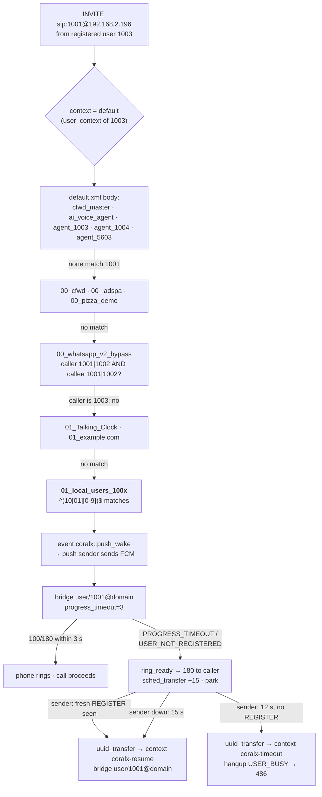

# 04 — The dialplan

## How a call is routed

1. An INVITE arrives on the `internal` profile. If the caller is a registered user, the
   channel gets that user's variables, including `user_context=default`; otherwise it
   lands in the profile's `context=public`.
2. The XML dialplan walks the context's extensions **in file order**, top to bottom. For
   each `<extension>`, the `<condition>`s are tested (regex on a channel field); the first
   extension whose conditions pass has its `<action>`s **queued**, and unless it says
   `continue="true"` the walk stops there.
3. The queued actions then execute in order. `bridge` blocks until the far end hangs up or
   fails; `transfer` re-runs the walk in another context; `park` waits for someone
   (the push sender) to move the channel.

File order for the `default` context is: the body of `dialplan/default.xml` **first**, then
`dialplan/default/*.xml` in **alphabetical** order (the include sits at the end of
`default.xml`). That order is the single most important fact on this page — see the
precedence trap below.

The authoritative list of what is active is FreeSWITCH's own parsed copy,
`var/log/freeswitch/freeswitch.xml.fsxml` (comments in the source files are misleading;
several `<!-- -->` blocks close mid-file). The tables below were generated from it on
2026-09-13.

## A call from 1003 to 1001, end to end

## Inventory — context `default`

In evaluation order. *Status* says whether the entry can actually work on this server.

| # | Number(s) | Extension | File | What it does | Status |
|---|---|---|---|---|---|
| 1 | `1003` | `cfwd_master` | `default.xml` | reads `hash(select/call_forward/1003)`; if a number is stored, `transfer` to it | works only if something has written that hash (nothing in the config does); otherwise falls through |
| 2 | `1234` | `ai_voice_agent` | `default.xml` | sets ~20 `AI_*` variables, plays a tone, `answer`, `audio_stream_ai` | **dead** — `mod_audio_stream` is on disk but not loaded, so the application does not exist. The block also holds a third-party API key in clear text; move it out of the dialplan |
| 3 | `1003` | `agent_1003` | `default.xml` | call-forward lookup, then `bridge user/1003@$${domain}` | works — **this is what a call to 1003 hits, never #14** |
| 4 | `1004` | `agent_1004` | `default.xml` | call-forward lookup, then `ring_ready` + `bridge user/1004@$${domain}` with `continue_on_fail=true` | works; on failure the walk continues to #14 |
| 5, 6 | `5603` | `agent_5603` (twice, identical) | `default.xml` | `bridge sofia/external/5603@192.168.20.56:5060` | depends on that host; duplicate entry is harmless |
| 7 | `1003` | `cfwd_master` (again) | `default/00_cfwd.xml` | same as #1 | unreachable — #3 always wins first |
| 8 | `101` | `101` | `default/00_ladspa.xml` (vanilla) | LADSPA audio-effects demo | **dead** — no `mod_ladspa` |
| 9 | `pizza`, `74992` | `pizza_demo` | `default/00_pizza_demo.xml` (vanilla) | JavaScript demo | **dead** — needs `mod_v8` |
| 10 | `1001`/`1002` **from** `1001`/`1002` | `whatsapp_v2_bypass_between_handsets` | `default/00_whatsapp_v2_bypass.xml` | `bypass_media=true`, `bridge user/$1@${domain_name}`, `continue_on_fail=true` | project test (2026-09-11): SDP crosses untouched so the phones can negotiate a codec the server lacks (Lyra, ADR-008). On failure continues to #14 |
| 11–13 | `9170`, `9171`, `9172` | `Talking Clock …` | `default/01_Talking_Clock.xml` (vanilla) | speaks time / date / both | works (`mod_say_en`) |
| — | 7 digits, 11 digits, `011…` | `*.example.com` | `default/01_example.com.xml` (vanilla) | `bridge sofia/gateway/${default_gateway}/…` | **dead** — no gateway is configured |
| 14 | `1000`–`1019` | **`local-users-100x`** | `default/01_local_users_100x.xml` | the push-wake route, see [05](05-push-wake.md) | **the route every Coral X test call takes** (except 1003/1004, see above) |
| 15 | `*97` | `cisco_voicemail_star97` | `default/02_cisco_features.xml` | `voicemail check default 192.168.103.24 ${caller_id_number}` | **stale** — the domain is hardcoded to the address the server had before 2026-09-07, so no mailbox is found. Replace `192.168.103.24` with `$${domain}` |
| 16 | `vm:NNNN` | `cisco_voicemail_deposit` | same | `voicemail default 192.168.103.24 $1` | **stale**, same fix |
| 17 | `3000` | `cisco_conference_3000` | same | `conference 3000@default` | works — the conference room `docs/testing.md` names |
| 18 | `9196` | `whatsapp_v2_echo` | `default/03_whatsapp_v2_test_apps.xml` | `answer`, `echo` (audio **and video** back to the caller) | project test |
| 19 | `9197` | `whatsapp_v2_bridged_echo` | same | `bridge loopback/9196/default` — a real two-leg call so an in-dialog REFER has a B-leg | project test |
| 20 | `9198` | `whatsapp_v2_tone` | same | `answer`, endless two-tone `tone_stream` | project test |
| — | `9199` | *(none)* | — | deliberately unrouted: `NO_ROUTE_DESTINATION`, the transfer target that says no | project test |

### The precedence trap

`agent_1003` (#3) has no `continue_on_fail`, so a call to **1003** whose bridge fails is
hung up right there — it never reaches the push-wake route (#14). **1004** does reach it,
but only after its own 30 s attempt. The Coral X handset under test is **1001**, which has
no earlier rule and goes straight to #14. If 1003/1004 need push wake, move their
call-forward logic into `01_local_users_100x.xml` (or delete `agent_1003`/`agent_1004`).

### Anything else you dial

Falls off the end of the context → `NO_ROUTE_DESTINATION` (a `404` to the caller). The
vanilla `Local_Extension` was replaced by `local-users-100x`; there is no operator, no
`*98`, no `9664` music-on-hold and no `9999`-style demos beyond the ones listed.

## The other contexts

| Context | File | Entries | Relevance |
|---|---|---|---|
| `public` | `dialplan/public.xml` | `unloop`, `public_to_ai_ivrs` (1234 → default), `outside_call`, `call_debug`, `public_extensions` (**1000–1019 → `transfer` to `default`**), `public_conference_extensions` (35xx–38xx), `public_did` (5551212) | where unauthenticated calls land (external profile, or an ACL-allowed source). `public_extensions` means an inbound trunk call for 1001 still ends up in `local-users-100x` |
| `features` | `dialplan/features.xml` | `dx`, `att_xfer`, `is_transfer`, `cf`, `please_hold`, `is_secure` | stock helpers used by `execute_extension`; nothing in the project references them |
| `coralx-resume`, `coralx-timeout` | `dialplan/coralx.xml` | one extension each for `^(10[01][0-9])$` | the push sender transfers parked calls here — [05](05-push-wake.md) |
| `skinny-patterns` | `dialplan/skinny-patterns.xml` | stock Cisco SCCP patterns | dead — `mod_skinny` is not loaded |

## Adding a route

* Put it in a new `dialplan/default/NN_name.xml` (an `<include>` with `<extension>`s), pick
  the prefix so it sorts where it must relative to `01_local_users_100x.xml`, and
  `fs_cli -x reloadxml`. No profile restart.
* Keep the per-call variables that the push route relies on out of new entries for
  1000–1019: `progress_timeout`, `continue_on_fail`, `hangup_after_bridge` are set inside
  `01_local_users_100x.xml` and `coralx.xml` on purpose.
* Verify with a real call and `grep <uuid> var/log/freeswitch/freeswitch.log | grep Dialplan`
  — every regex the walk tests is logged as `Regex (PASS|FAIL) [extension] field(value) =~ /re/`.
