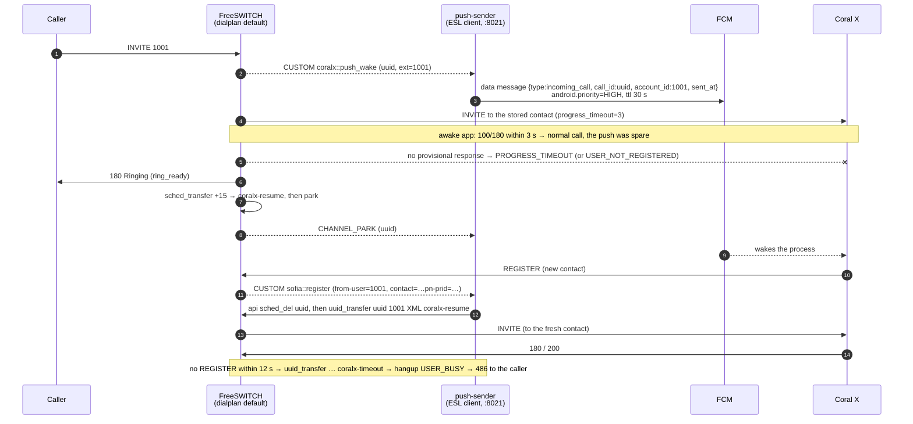

# 05 — Push wake: ringing a phone that is asleep

The client-side decision is ADR-004 in [`../architecture.md`](../architecture.md); the
gateway's own runbook is `~/Desktop/coralx-push-sender/README.md`. This page is the
**server side**: what is configured, why each line is there, how it was measured, and how
to take it out.

## The problem it solves

A Coral X handset that is dozing, has its screen off for a while, or was swiped from
Recents still has a row in `sip_registrations` — but nothing is listening behind it. An
INVITE to that contact gets no `100 Trying` and dies after `call_timeout` as
`ORIGINATOR_CANCEL`. **"Registered" is not "reachable."** Android will not let the app hold
a socket open forever, so the server has to wake the phone (FCM) and then wait for the one
thing that proves it is back: a REGISTER that arrives *after* the push.

## Design



Three properties fall out of this shape:

* **An awake phone is not slowed down.** The direct attempt goes first; the push is only
  consumed if that attempt gets no provisional response within 3 s.
* **A rejection still reaches the caller.** `continue_on_fail` lists only the "nobody is
  there" causes; a `486`/`603` from a live app propagates as itself.
* **The sender is not a single point of failure.** If it is down, the `sched_transfer`
  fires after 15 s and the call is bridged exactly as the old single-`bridge` dialplan did.
  (The cost of a dead sender is 3 + 15 s of ringback before that.)

## What is installed (three files)

Canonical copies live in the sender repo under `deploy/freeswitch/`; the installed files
are the ones below. Originals are kept next to them as `.bak.<timestamp>`.

### 1. `dialplan/default/01_coralx_push_wake.xml` — the hook

```xml
<extension name="coralx-push-wake">
  <!-- any number that is a user in the directory: no extension range, no IP -->
  <condition field="${user_exists(id ${destination_number} $${domain})}" expression="^true$">
    <action application="set" data="hangup_after_bridge=true"/>
    <action application="set" data="call_timeout=30"/>

    <!-- 1. announce; Event-Name=CUSTOM is required or the event app fires CHANNEL_APPLICATION -->
    <action application="event" data="Event-Name=CUSTOM,Event-Subclass=coralx::push_wake,Push-Ext=${destination_number},Push-Caller=${caller_id_number}"/>

    <!-- 2. the direct attempt: 3 s for a provisional response; fall through only when nobody is there -->
    <action application="set" data="progress_timeout=3"/>
    <action application="set" data="continue_on_fail=PROGRESS_TIMEOUT,USER_NOT_REGISTERED,NO_ROUTE_DESTINATION,NETWORK_OUT_OF_ORDER,RECOVERY_ON_TIMER_EXPIRE,NORMAL_TEMPORARY_FAILURE,ORIGINATOR_CANCEL"/>
    <action application="bridge" data="user/${destination_number}@$${domain}"/>

    <!-- 3. ringback, a fallback in case the sender is down, park -->
    <action application="log" data="INFO push_wake: no progress from ${destination_number} (${originate_disposition}); parking for the push sender"/>
    <action application="ring_ready"/>
    <action application="sched_transfer" data="+15 ${destination_number} XML coralx-resume"/>
    <action application="park"/>
  </condition>
</extension>
```

| Line | Why |
|---|---|
| `condition field="${user_exists(…)}"` | the rule applies to every directory user, so a new deployment with a different numbering plan changes nothing here. `$${domain}` is the server's own domain from `vars.xml`; per-user special routes (call forwarding, IVRs) must sit in a file that sorts before `01_coralx_push_wake.xml` or in the body of `default.xml`. |
| `event … Event-Name=CUSTOM` | `mod_dptools`' `event` app creates a `CHANNEL_APPLICATION` event unless told otherwise; an ESL subscription to `CUSTOM coralx::push_wake` never sees that. Found the hard way. |
| `progress_timeout=3` | A PJSIP client sends `100 Trying` the instant the INVITE arrives, so 3 s only fails for a dead socket. Measured: the attempt is abandoned at 3.2–4.0 s (the originate loop's granularity), cause `PROGRESS_TIMEOUT`. |
| `continue_on_fail=<list>` | `true` would also "continue" past a live callee's `486`, sending the caller to ringback and park. The list names only unreachable causes. `USER_NOT_REGISTERED` is in it: a phone whose hour-long registration expired while asleep still has its token in the sender's registry. |
| `ring_ready` | `180` to the caller; they hear ringback for the whole wait. |
| `sched_transfer +15 … coralx-resume` | Scheduled under the channel UUID as its task group. The sender cancels it with `sched_del <uuid>` before it moves the call itself. |
| `park` | Emits `CHANNEL_PARK`, which is the sender's cue that the caller is now waiting. |

### 2. `dialplan/coralx.xml` — where parked calls go

```xml
<context name="coralx-resume">          <!-- the device registered: bridge -->
  <extension name="coralx-resume">
    <condition field="${user_exists(id ${destination_number} $${domain})}" expression="^true$">
      <action application="set" data="hangup_after_bridge=true"/>
      <action application="set" data="call_timeout=30"/>
      <action application="unset" data="progress_timeout"/>       <!-- full ring time now -->
      <action application="set" data="continue_on_fail=false"/>   <!-- a 486/603 is final -->
      <action application="log" data="INFO push_wake: resuming ${destination_number} after ${sip_call_id}"/>
      <action application="bridge" data="user/${destination_number}@$${domain}"/>
    </condition>
  </extension>
</context>

<context name="coralx-timeout">         <!-- it did not: busy, not dead air -->
  <extension name="coralx-timeout">
    <condition field="${user_exists(id ${destination_number} $${domain})}" expression="^true$">
      <action application="log" data="WARNING push_wake: ${destination_number} did not wake in time; busy to the caller"/>
      <action application="hangup" data="USER_BUSY"/>             <!-- 486 Busy Here -->
    </condition>
  </extension>
</context>
```

Voicemail instead of 486: replace the `hangup` with `answer` +
`voicemail default $${domain} ${destination_number}` (`mod_voicemail` is loaded; the user
files carry `vm-password`).

### 3. `directory/default.xml` — the dial-string

Explained in [03](03-directory-users.md#the-dial-string--where-user1001-becomes-a-real-target):
strips the `pn-*` parameters so the INVITE to the phone is 1306 bytes instead of 1675.

## The sender

`coralx-push-sender` (Go, no dependencies) connects to `mod_event_socket` and subscribes to
`CHANNEL_PARK CHANNEL_HANGUP_COMPLETE CUSTOM sofia::register coralx::push_wake` in JSON.

| It does | Detail |
|---|---|
| Token registry | reads `pn-provider`/`pn-param`/`pn-prid` from the `contact` of every `sofia::register`; seeds itself from `show registrations` at start; persists to `data/tokens.json` so a phone that has been asleep for a day (registration long expired) can still be woken |
| Push | on `coralx::push_wake`, immediately; FCM HTTP v1, service-account JWT, `android.priority=HIGH`, data-only, exactly the four ADR-004 keys, TTL 30 s. `UNREGISTERED` from FCM forgets the token |
| Resume | on `CHANNEL_PARK` + a `sofia::register` for that extension after the push: `api sched_del <uuid>`, `api uuid_transfer <uuid> <ext> XML coralx-resume` |
| Timeout | 12 s after the push with no REGISTER (or no token at all): `uuid_transfer … coralx-timeout` |
| Operator API | `127.0.0.1:8085` — `/healthz`, `/tokens`, `/calls`, `POST /push {"account_id":"1001"}` (send the wake without a call) |

Run it: `./bin/push-sender -data-dir data -service-account data/firebase-service-account.json`;
without the key it runs dry (everything but the FCM send). A launchd plist is in its
`deploy/launchd/`. **If it is not running, a call to an asleep phone waits 3 + 15 s before
the fallback bridge** — start it before device testing.

Two ESL facts that cost time and are worth knowing: FreeSWITCH's JSON events contain
**arrays** (`variable_DP_MATCH` on any channel that matched a regex), so a decoder that
expects only strings silently drops every `CHANNEL_PARK`; and right after a client
restarts, the event socket sometimes sends no `auth/request` for 10–20 s — reconnect,
don't debug.

## Measured (2026-09-12, scripted SIP UA on the Mac, sender in dry-run)

| Scenario | Caller saw | Where the time goes |
|---|---|---|
| stale contact, no REGISTER ever | `100` → `180` at 3.5 s → **`486` at 12.3 s** | 3 s direct attempt, then the sender's 12 s budget from the push |
| stale contact, fresh REGISTER 5 s in | `180` at 3.2 s → `603` from the phone at **6.0 s** | resume happened 40 ms after the REGISTER event |
| registration expired, no REGISTER | `180` at 0.2 s → `486` at 12.3 s | `USER_NOT_REGISTERED` is instant, so ringback starts at once |
| live phone | `180` at 0.08 s, its `486` propagated at 1.1 s | the push was sent and ignored; nothing parked |
| sender stopped | `180` at 3.5 s → bridged by the fallback at 15 s | `sched_transfer` |

The B-leg INVITE with the `pn-*` parameters in Request-URI, Route and To was 1675 bytes;
with the dial-string strip it is 1306.

## Verifying on a real handset

1. `curl -s localhost:8085/tokens` shows the handset's extension with a redacted token
   (it appears after the app's first REGISTER carrying `pn-*`, which needs
   `app/google-services.json` in the client build).
2. `curl -s -X POST localhost:8085/push -d '{"account_id":"1001"}'` — within seconds
   `fs_cli -x "sofia status profile internal reg 1001"` must show a **new contact port**,
   and the sender log a `REGISTER with push token` line.
3. Swipe the app away, wait, call 1001: the sender log reads `sending FCM` →
   `caller parked` → `fresh REGISTER` → `call moved on resume=true`, and
   `grep push_wake var/log/freeswitch/freeswitch.log` shows the park and the resume.

## Rollback

```bash
cd /usr/local/freeswitch/etc/freeswitch
rm dialplan/default/01_coralx_push_wake.xml
cp dialplan/default/01_local_users_100x.xml.bak.20260912-215353 dialplan/default/01_local_users_100x.xml
rm dialplan/coralx.xml
cp directory/default.xml.bak.20260912-221132 directory/default.xml
/usr/local/freeswitch/bin/fs_cli -x reloadxml
```

That restores the single `bridge` line. The sender can keep running (it will log events
and never be asked to move a call) or be stopped. The client needs nothing: without a
gateway the app registers and takes calls exactly as before.
