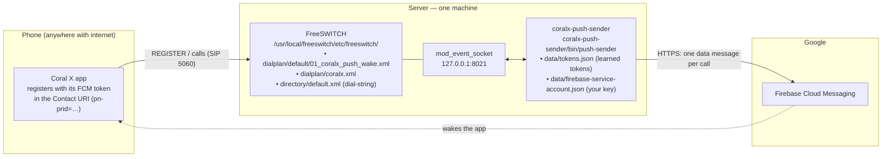
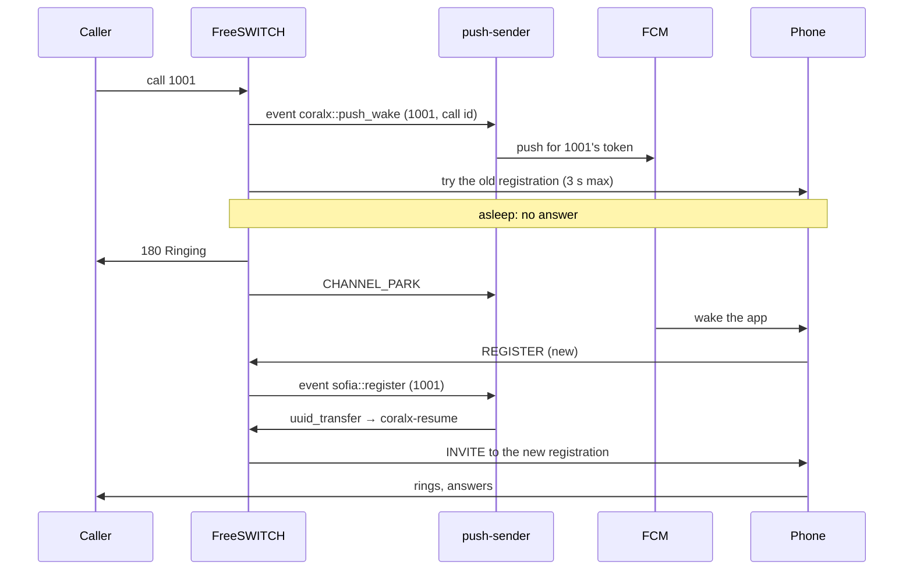

# 09 — coralx-push-sender: how everything works, and why nothing is hard-coded

This page explains the push sender in plain words: what it is, where every piece lives,
how a call flows through it, and what you set when you install it on a **new** server.
The short answer to "what do I change per deployment?" is: **four things, none of them
in code** — see [What you set once per deployment](#what-you-set-once-per-deployment).

## What it is

Coral X phones fall asleep. Android stops the app after a while, so the phone's SIP
registration in FreeSWITCH points at a socket that no longer answers. A call to that
phone would ring nobody.

`coralx-push-sender` is a small program that runs next to FreeSWITCH. When a call comes
in for a phone, it sends a **push message** (Firebase Cloud Messaging) that wakes the app.
The app registers again. The sender sees that new registration and lets the call through.
While all this happens, the caller hears ringback.

## The pieces and where they run



Everything the sender knows, it **learns while running**: which phones exist, their push
tokens, the server's SIP domain, the calls in progress. It never reads an IP address or an
extension number from a config file.

## The flow of one call, step by step

1. Someone dials a phone's number. FreeSWITCH looks the number up in its directory
   (`user_exists`). If it is a user, the push-wake rule runs.
2. The rule **announces** the call: it fires an event named `coralx::push_wake` with the
   number and the call's ID. The sender hears it on the event socket.
3. The sender looks up the number in its token list and **sends the push** right away.
4. At the same time FreeSWITCH **tries the phone directly**, but only for 3 seconds. An
   awake phone answers within that time and the call simply proceeds — the push was a
   spare wake-up, nothing else happens.
5. A sleeping phone does not answer. FreeSWITCH sends **ringback** to the caller and
   **parks** the call. The sender hears `CHANNEL_PARK`.
6. The push reaches the phone. The app starts and sends a **new REGISTER**.
7. FreeSWITCH tells the sender about that REGISTER (`sofia::register`).
8. The sender **un-parks** the call: it moves it to the `coralx-resume` context, which
   dials the phone's fresh registration. The phone rings.
9. If no REGISTER arrives within 12 seconds, the sender moves the call to
   `coralx-timeout` instead: the caller gets **486 Busy** rather than silence.
10. If the sender itself is not running, FreeSWITCH's own 15-second fallback moves the
    call to `coralx-resume` anyway — the same single bridge the server did before push
    wake existed.



## Nothing to edit per deployment — where each value comes from

| Value | Comes from | So on a new server… |
|---|---|---|
| The server's IP / SIP domain | `$${domain}` in FreeSWITCH's `vars.xml`; the sender never needs it (it talks to FreeSWITCH on `127.0.0.1:8021`) and records the realm from the `sofia::register` event | nothing to do — whatever `vars.xml` says is used |
| Which numbers get push wake | `user_exists(id <number> $${domain})` in the dialplan: every user in the directory | add users to the directory; the rule follows |
| A phone's push token | the `pn-prid` parameter the app puts in its REGISTER; read from `sofia::register` events, seeded from `show registrations` at start, kept in `data/tokens.json` | nothing to do — phones announce themselves |
| The FCM sender id (`pn-param`) | the app reads it from its own `google-services.json` | nothing to do on the server |
| The Firebase project | the sender's service-account key file (`project_id` inside it) | drop the key file in place |
| The call to move, and where to send it | the channel UUID from the events; the contexts `coralx-resume` / `coralx-timeout` (flags, with defaults that match the shipped dialplan) | nothing to do |
| Timings | flags: `-wake-timeout 12s`, `-push-ttl 30s`; dialplan: `progress_timeout=3`, `sched_transfer +15` | defaults work; tune only if you must |

## What you set once per deployment

| # | What | Where | How |
|---|---|---|---|
| 1 | Event-socket address and password | environment or flags: `PUSH_SENDER_ESL_ADDR` (default `127.0.0.1:8021`), `PUSH_SENDER_ESL_PASSWORD` (default `ClueCon`) | match `autoload_configs/event_socket.conf.xml` on that server; change the stock password there and here |
| 2 | Firebase service-account key | `PUSH_SENDER_SERVICE_ACCOUNT=/path/to/firebase-service-account.json` | Firebase console → Project settings → Service accounts → *Generate new private key*. Never in git, never in the APK |
| 3 | Where the sender keeps its state | `PUSH_SENDER_DATA_DIR` (default `data`) | any writable directory; `tokens.json` lives there |
| 4 | The app's Firebase config | `whatsapp-v2/app/google-services.json` at build time (gitignored) | one file per Firebase project; the build turns it into resources, no plugin |

Every flag has an environment variable: `PUSH_SENDER_` + the flag name in upper case with
`-` → `_`. `./bin/push-sender -h` lists them all.

## The FreeSWITCH side — three files, copied as they are

All three come from `coralx-push-sender/deploy/freeswitch/` and are the same for every
server. Install, then `fs_cli -x reloadxml`.

| Copy this | To | It does |
|---|---|---|
| `dialplan/default/01_coralx_push_wake.xml` | `etc/freeswitch/dialplan/default/` | the rule from the flow above: announce → 3 s direct try → ringback → 15 s fallback → park |
| `dialplan/coralx.xml` | `etc/freeswitch/dialplan/` | the two contexts the sender moves calls into: `coralx-resume` (dial the phone), `coralx-timeout` (486; a voicemail variant is in the comments) |
| `directory/dial-string.snippet.xml` | replaces the `dial-string` param in `etc/freeswitch/directory/default.xml` | removes the long push token from the INVITE FreeSWITCH sends to the phone (1675 → 1306 bytes, no IP fragmentation) |

Needed modules — all in a stock build: `mod_event_socket`, `mod_dptools`, `mod_commands`,
`mod_sofia`. **No Lua.** One profile setting matters: leave `multiple-registrations`
unset, so a phone's new REGISTER replaces its old row.

Order matters in `dialplan/default/`: files are read alphabetically, and the first rule
that matches a number wins. Per-user special routing (call forwarding, an IVR) must sit
in a file that sorts *before* `01_coralx_push_wake.xml`, or in the body of
`dialplan/default.xml` — see [04](04-dialplan.md).

## The sender — paths inside the repository

```
coralx-push-sender/
├── cmd/push-sender/main.go     flags & env, connects to the event socket, dispatches events
├── internal/esl/               the event-socket client (auth, subscribe, api, JSON events)
├── internal/registry/          number → push token; parses pn-* from a contact; tokens.json
├── internal/fcm/               FCM HTTP v1: service-account JWT → bearer token → send
├── internal/wake/              the per-call state machine: push → wait → resume / timeout
├── internal/httpapi/           GET /healthz  GET /tokens  GET /calls  POST /push
├── deploy/freeswitch/          the three FreeSWITCH files above
├── deploy/launchd/             a macOS user agent (edit its three paths)
├── data/                       tokens.json + your Firebase key (gitignored)
└── bin/push-sender             the binary: go build -o bin/push-sender ./cmd/push-sender
```

Run it:

```bash
cd coralx-push-sender
go build -o bin/push-sender ./cmd/push-sender
PUSH_SENDER_SERVICE_ACCOUNT=data/firebase-service-account.json ./bin/push-sender
```

Without the key it runs **dry**: it does everything except the FCM send, which is how the
park/resume path is tested with a scripted SIP phone. Logs go to stderr (one line per
state change; tokens are never printed whole).

The operator API on `127.0.0.1:8085`:

| Call | Answer |
|---|---|
| `GET /healthz` | `{"esl":true,"fcm":true,"project":"…","tokens":N}` — 503 while the event socket is down |
| `GET /tokens` | every number that has a token: realm, provider, redacted token, when it was last seen |
| `GET /calls` | the calls the sender is holding right now and their state |
| `POST /push` with `{"account_id":"1001"}` | sends the wake push to that phone without a call — the phone must REGISTER within seconds |

## Deploying to a new server — checklist

1. FreeSWITCH: copy the three files, `fs_cli -x reloadxml`, check
   `fs_cli -x "xml_locate dialplan"` lists `coralx-resume` and `coralx-timeout`.
2. Firebase: one project per deployment (or share one). Put its `google-services.json`
   into the client build; put its service-account key on the server.
3. Sender: build, set `PUSH_SENDER_ESL_PASSWORD` and `PUSH_SENDER_SERVICE_ACCOUNT`, start
   it (the launchd plist or a systemd unit — it only needs to be restarted, it reconnects
   on its own).
4. Check: `curl -s localhost:8085/healthz` → `"esl":true,"fcm":true`. Register a phone,
   then `curl -s localhost:8085/tokens` shows it. `POST /push` makes it re-register.
5. Call the phone with the app swiped away. The sender log reads `sending FCM` →
   `caller parked` → `fresh REGISTER` → `call moved on resume=true`.

## What happens if…

| Situation | Result |
|---|---|
| the sender is not running | calls to sleeping phones ring for 3 + 15 s, then FreeSWITCH bridges by itself (old behaviour); awake phones are unaffected |
| the sender restarts | it reconnects to the event socket with back-off and re-reads live registrations; a call parked during the gap is caught by the 15 s fallback |
| FCM is unreachable | the push fails, the caller still gets ringback and, after 12 s, 486; the sender retries the send once |
| FCM says the token is dead (`UNREGISTERED`) | the token is forgotten; the next call to that phone gets 486 immediately when it parks, until the phone registers again |
| the phone's registration expired while asleep | the token is still in `tokens.json`; the direct try fails instantly (`USER_NOT_REGISTERED`), the push goes out, the wait proceeds as normal |
| a phone without push (a desk phone) is unreachable | no token → the parked caller gets 486 at once instead of waiting |
| the phone is awake | the direct try succeeds within 3 s; the push arrives and only makes the app refresh its registration |
| two servers share one Firebase project | fine — the token identifies the phone, not the server |
| one server has several SIP domains | not supported as-is: the token list is keyed by user, and `user_exists` uses `$${domain}` |

## Where to look when it does not work

| Check | Command |
|---|---|
| the sender sees FreeSWITCH | `curl -s localhost:8085/healthz` |
| the phone announced a token | `curl -s localhost:8085/tokens`; `fs_cli -x "sofia status profile internal reg 1001"` shows `pn-prid=` in the Contact |
| the dialplan rule ran | `grep push_wake /usr/local/freeswitch/var/log/freeswitch/freeswitch.log` |
| what the sender did with a call | `grep push_wake ~/Library/Logs/coralx-push-sender.log` (or wherever its stderr goes) |
| the event actually reaches the socket | the event is fired with `Event-Name=CUSTOM`; without it FreeSWITCH emits `CHANNEL_APPLICATION` and the sender never sees it |
