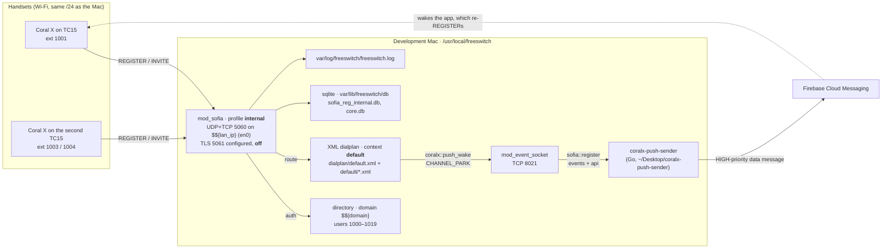

# FreeSWITCH configuration for Coral X — start here

This folder documents the FreeSWITCH server that Coral X (this repository, `whatsapp-v2`)
registers against, places calls through, and is woken by. It is written for the next
developer: every path, parameter and value below was read from the running server on
2026-09-13, not from a template, and each page says how to check it again.

**The server:** FreeSWITCH **1.10.11-release** (git `f24064f`, 2023-12-22), installed under
`/usr/local/freeswitch` on the development Mac, started by hand as
`bin/freeswitch -nc -nonat`. Its configuration root is **`/usr/local/freeswitch/etc/freeswitch`**
— not `…/conf`, which does not exist here and makes every `grep` against it silently
return nothing.

## Blueprint

## The facts you need in the first minute

| | Value | Read it from |
|---|---|---|
| Config root | `/usr/local/freeswitch/etc/freeswitch` | — |
| SIP address | whatever `bin/lan-ip.sh` prints (en0 first) — **`$${domain}` is that IP**, so the SIP domain changes with the network | `vars.xml` lines 69–71 |
| SIP port / transports | 5060 UDP and TCP; TLS 5061 is configured but `internal_ssl_enable=false` and there is no SIP certificate | `vars.xml`, `sip_profiles/internal.xml`, `tls/` |
| Users | `1000`–`1019`, one file each; **1018 and 1019 are reserved for automation** | `directory/default/10xx.xml`, `docs/testing.md` |
| Password | the stock `default_password` in `vars.xml` — a credential, so not written here; change it before any exposure | `vars.xml` line 15 |
| Codecs that actually work | **PCMU, PCMA** for audio, **VP8** for video (Opus, G.722, H.264 are configured but their modules are missing) | [06-modules-and-codecs.md](06-modules-and-codecs.md) |
| SRTP | an `a=crypto` line on an `RTP/AVP` m-line is answered **488** — the app's media encryption must be *off* or *SAVP* against this server | [02-sip-profile-internal.md](02-sip-profile-internal.md) |
| Event socket | `[::]:8021`, password `ClueCon` (the stock one) | `autoload_configs/event_socket.conf.xml` |
| Push wake | dialplan announces → 3 s direct attempt → park → the sender un-parks on the device's fresh REGISTER, 486 after 12 s; applies to every directory user, nothing per-deployment in it | [05-push-wake.md](05-push-wake.md), [09](09-push-sender-how-it-works.md) |
| Capacity | `max-sessions=1000`, `sessions-per-second=30` | `autoload_configs/switch.conf.xml` |
| Log | `/usr/local/freeswitch/var/log/freeswitch/freeswitch.log`, debug level, rotates at 1 GB | `autoload_configs/logfile.conf.xml` |

## The pages

| Page | Read it when |
|---|---|
| [01-server-layout-and-startup.md](01-server-layout-and-startup.md) | you need to find something on disk, start or restart the server, or the Mac changed network |
| [02-sip-profile-internal.md](02-sip-profile-internal.md) | a registration or a call is refused and you suspect the profile; you want to know why the app is configured the way it is |
| [03-directory-users.md](03-directory-users.md) | you add a user, change a password, or wonder why a call to a push-registered phone has a short INVITE |
| [04-dialplan.md](04-dialplan.md) | you dial a number and want to know what will happen, or need to add a route |
| [05-push-wake.md](05-push-wake.md) | anything about calls reaching a phone that is asleep — design, install, test, rollback |
| [06-modules-and-codecs.md](06-modules-and-codecs.md) | a codec is "not negotiated", hold music is silent, or a dialplan app "does not exist" |
| [07-operations-cheatsheet.md](07-operations-cheatsheet.md) | day-to-day: `fs_cli` commands, verifying a registration, tracing SIP, the failures seen so far and their fixes |
| [08-changelog.md](08-changelog.md) | you need to know what differs from a vanilla install, when it changed, and where the backup is |
| [09-push-sender-how-it-works.md](09-push-sender-how-it-works.md) | you deploy the push sender on a new server: how it works in plain words, where every piece lives, why nothing is hard-coded, the four things you set per deployment |

## Conventions in these pages

* **Paths** are relative to the config root unless they start with `/`.
* **`$${name}`** is a FreeSWITCH *global* variable (set in `vars.xml`, expanded when the XML
  is parsed); **`${name}`** is a channel variable (expanded per call).
* **No secrets.** The SIP password, the event-socket password and any API key are named by
  the file and line that hold them, never quoted. The one exception is `ClueCon`, which is
  FreeSWITCH's public default and is listed precisely so it gets changed.
* **Verify, don't trust.** Each table names the file or the `fs_cli` command that proves
  it. The server has been edited by hand since these pages were written if the two
  disagree — update the page, not the reader.

## Related documents in this repository

* [`../architecture.md`](../architecture.md) — ADR-004 (push wake), ADR-005 (this server is
  the test target, no Docker), §3.1 (the test-target facts as the client sees them).
* [`../testing.md`](../testing.md) — the instrumented suite, the Gradle properties it takes,
  the reserved extensions.
* [`../calling.md`](../calling.md) — the call path inside the app, including the wake path.
* [`../../coralx-push-sender/README.md`](../../coralx-push-sender/README.md) — the push gateway's own runbook (its own git repository, checked out inside this one).
