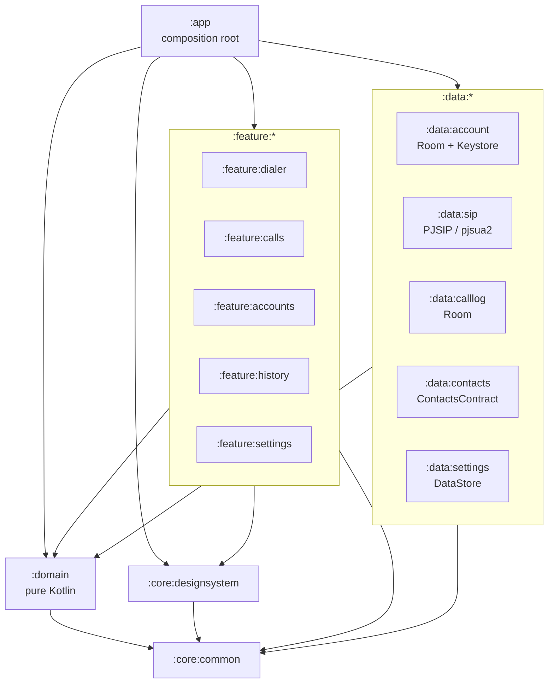
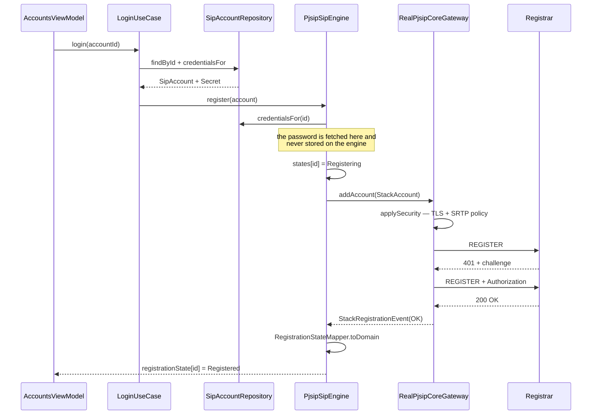
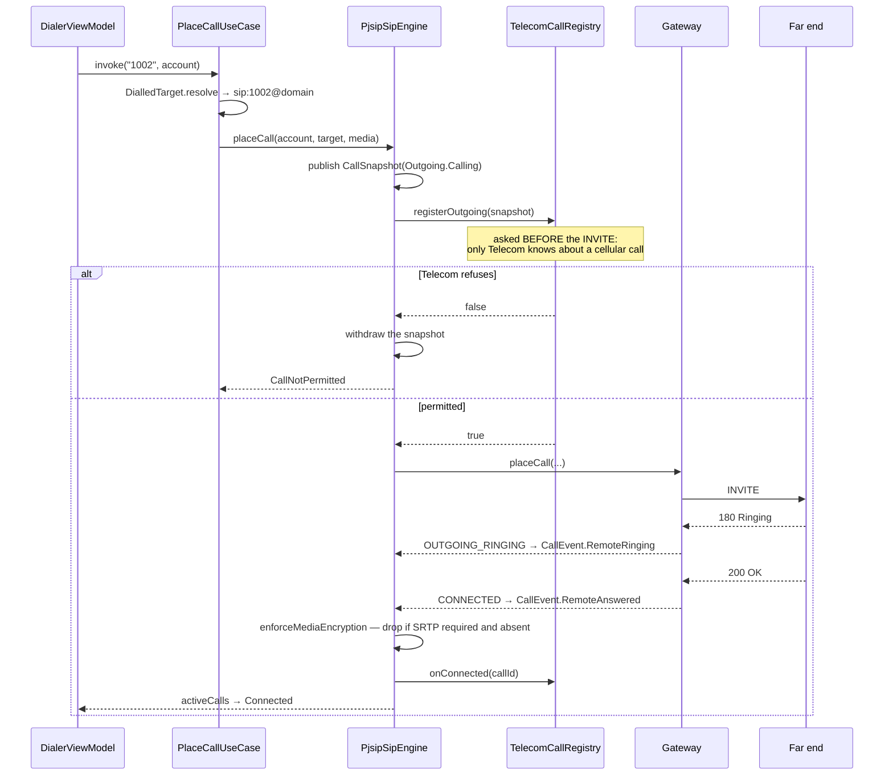
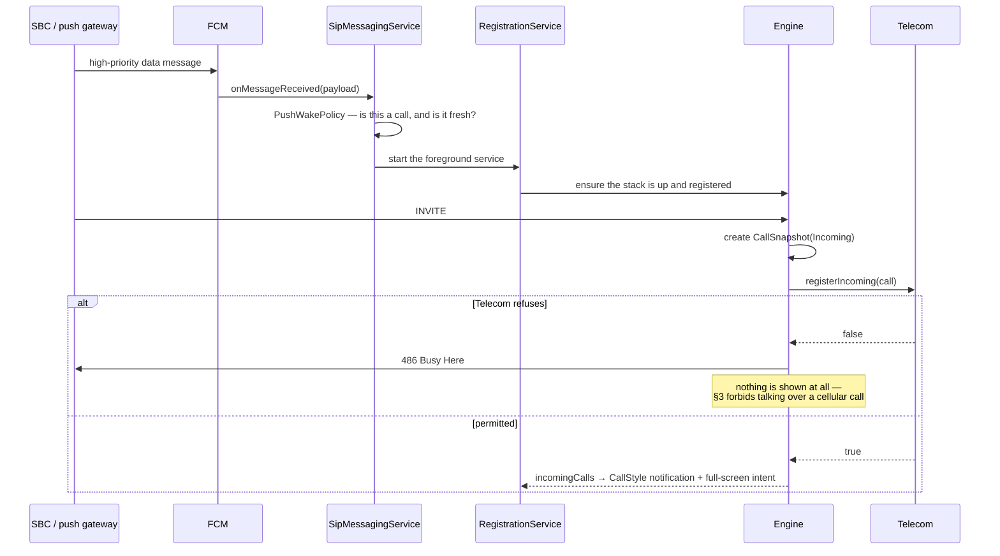
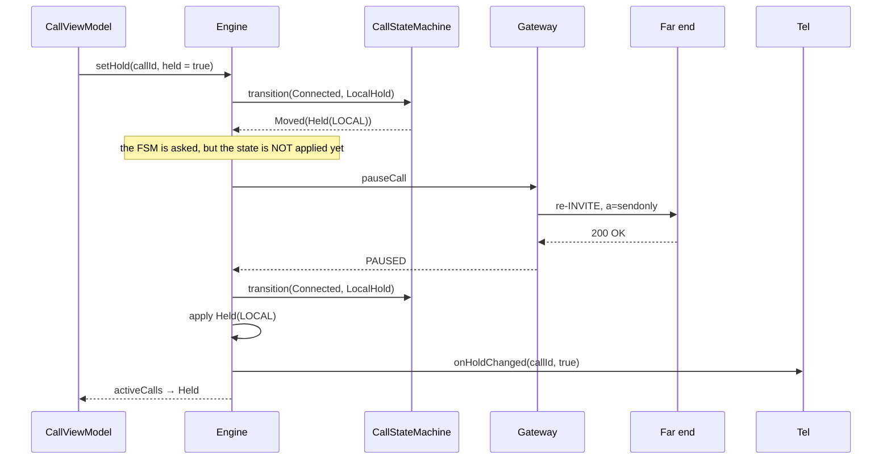
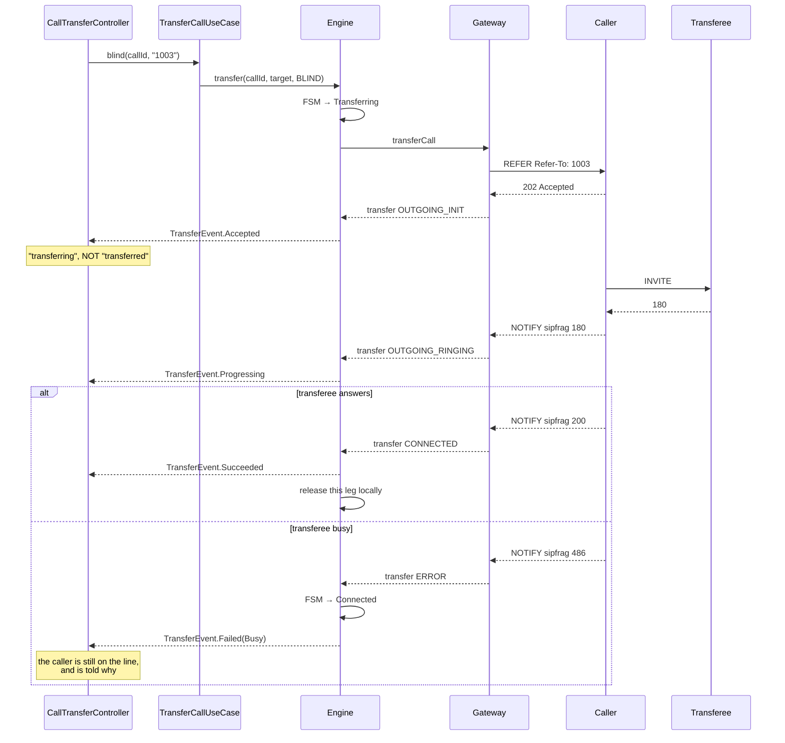
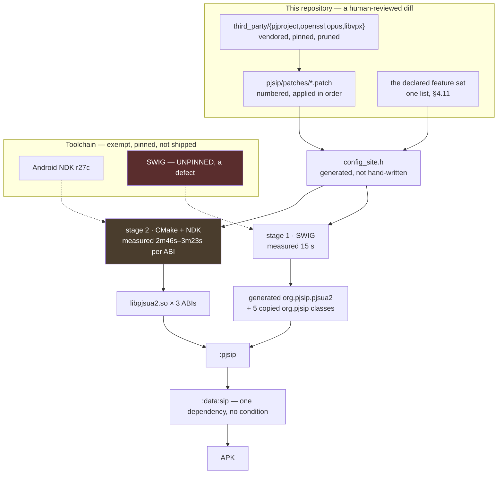

# Architecture — Native Android SIP Client

**Status:** Task 1 complete (decision record open). HLD sections — module graph, layer
diagram, sequence diagrams, threading model — are authored in **Task 67** and are
deliberately absent here rather than stubbed with placeholder content.

**Source of requirements:** [`android-sip-app-prompt.md`](android-sip-app-prompt.md)
**Task plan:** kept outside the repository as working notes.

---

## 1. Decisions

Five decisions, four settled and one carried as an open cost item. Each records what was
decided, why, what it costs, and how to reverse it.

### ADR-001 — SIP stack (superseded)

**Status:** **SUPERSEDED by ADR-006 on 2026-09-08** · **Decided:** 2026-09-04

Chose a third-party SIP stack consumed as a prebuilt AAR, because `android.net.sip` was
deprecated in API 31 and removed. Its reasoning outlived its conclusion: the `SipEngine`
seam it argued for is exactly what later made replacing the stack a rewrite of two files
rather than of a module.

The stack it chose is gone — see ADR-006 for what replaced it and why. The full original
text is in this file's git history if the trade-offs are ever needed again; it is not
reproduced here, because a removed dependency named forty times in a live document reads
as a dependency.

---

### ADR-002 — Licence position: **GPLv2 working assumption, commercial licence UNRESOLVED**

**Status:** ⚠️ **Open — blocks release, not development** · **Owner:** needs a business decision ·
**Revised:** 2026-09-08 (ADR-006 changed which licence applies)

**Context.** The distribution model is not yet decided, and the stack move changed the
terms. PJSIP is dual-licensed **GPLv2 or a commercial licence from Teluu** — verified
from `COPYING` in the pjproject 2.17 tarball, which is GPL *version 2*, not 3. The
superseded stack was GPLv3 or commercial from its vendor. There is no free
closed-source path with either.

**What the change is worth.** GPLv2 rather than GPLv3 removes the anti-tivoization and
installation-information clauses, which are the terms that interact most awkwardly with
app-store distribution. That is a simplification, **not** a reprieve: a closed-source
release still needs a commercial licence, and the vendor to buy it from is now Teluu.

**New obligations this build introduces.** Building PJSIP from source bundles two
libraries the previous AAR carried for us, and each has its own terms:

| Component | Licence | Obligation |
|---|---|---|
| PJSIP (pjproject 2.17) | GPLv2 or commercial (Teluu) | The decision below |
| OpenSSL 3.5.0 | Apache-2.0 | Attribution; no copyleft |
| Opus 1.5.2 | BSD-3-Clause | Attribution; no copyleft |

The two permissive ones need an attribution notice in the shipped app. That is a small
task, and it is a task that did not exist while the AAR was somebody else's to assemble.

**Decision (provisional).** Develop against the **GPLv2 terms**. This is the assumption
that is safe to build under, because it constrains nothing during development and
converting *later* costs money but not code.

**The consequence, stated plainly:**

| Distribution model | Obligation |
|---|---|
| App source published under GPLv2 | No fee. Your entire app becomes GPLv2. |
| Shipped to customers, source closed | **Commercial licence required.** Typically a recurring annual fee. |
| Internal / single-client enterprise | Still distribution. Offer source to recipients, or licence commercially. |

**Why this is flagged rather than assumed away.** If the app ships closed-source, the
licence is a **purchase**, and discovering that after Phase 9 is an expensive surprise.
Nothing in Phases 1–8 depends on the answer, so development proceeds — but the answer is
needed before any external release.

**Action required (not by engineering):**
1. Decide the distribution model.
2. If closed-source: obtain a quote from **Teluu** and budget it. (A Belledonne quote, if
   one was already sought, is now moot — ADR-006 removed that dependency.)
3. Have counsel review the GPLv2 path if it is chosen. **This document is not legal
   advice.**
4. Add an attribution notice covering OpenSSL (Apache-2.0) and Opus (BSD-3-Clause),
   which this build now bundles directly.

**Review date:** before Task 64 (release build). Escalate if unresolved by Phase 8.

---

### ADR-003 — Conference: **FreeSWITCH `mod_conference`, dial-in MCU**

**Status:** Accepted · **Decided:** 2026-09-04 · **Decider:** stakeholder (existing infrastructure)

**Context.** SIP is point-to-point; multi-party calling requires a conference focus
server-side (§2.2). A FreeSWITCH instance is already deployed and will be used.

**Decision.** **Dial-in MCU** (§2.2 option a) using FreeSWITCH `mod_conference`. The
client places one ordinary call to a conference URI; the server mixes and returns a
single stream.

**Why.** It follows from the infrastructure, and it is the recommended default anyway:
it works over baseline SIP with no signalling extension, needs one decode path on the
client, and keeps device CPU and battery cost flat as participants grow — which matters
on the mid-range Android hardware most users will have.

**What we give up.** No per-participant video layout control, and no client-side
selective forwarding. Active-speaker or grid layout is whatever the bridge composes.

**Reversibility.** Preserved by design. `ConferenceSession` (Task 59) models **N**
participant streams with no dial-in-specific assumption baked in, so moving to an SFU is
an implementation swap in `:data:sip`, not a domain rewrite.

**Verify before Phase 8 (Task 60):**
- Confirm the FreeSWITCH conference profile, the dial-in extension pattern, and the PIN
  policy on the deployed instance.
- Confirm whether the deployment publishes a **participant roster** the client can
  subscribe to. If it does not, Task 60's participant list shows what is actually known
  and says so — it does **not** render a fabricated list (§13).

> **Superseded for audio by ADR-009** (2026-09-11): audio conferences up to 8 participants
> are mixed on the device with `pjmedia_conf`. This ADR still governs **video**
> conferencing, which the ADR-009 gate measured and refuted for this hardware.

**Both answered on hardware, 2026-09-11, and the answer is settled rather than pending**
(decided with the stakeholder, 2026-09-11): extension `3000` on the local FreeSWITCH joins
`mod_conference`, and `conference list` showed this app's leg as
`hear|speak|talking|floor` with DTMF `0` muting it over RFC 4733. No roster is subscribed
to, so `SipCallGateway.conferenceEvents` **never emits** and
`PjsipSipEngine.conferences` stays empty — which is the second bullet doing its job, not
failing it: the client renders nothing rather than a fabricated list.

Two consequences are deliberate and are written here so neither is rediscovered as a gap:

- **There is no "Join conference" button, and none is wanted.** Joining is dialling the
  bridge's extension in the ordinary dialler, because under this ADR a conference *is* an
  ordinary call. A button beside it would be a second name for the same act.
- **`JoinConferenceUseCase` therefore has no caller**, and it stays. It is the shape of
  the seam, not dead weight: it is the one path that marks a leg as a conference so a
  roster could attach to it, and it is what an SFU swap (the *Reversibility* paragraph
  above) would be wired into. Before adding a roster, verify the bridge publishes one —
  RFC 4575 conference-event `SUBSCRIBE` against `mod_conference` — because the domain is
  ready for participants and the server is what currently has none to give.

---

### ADR-004 — Push wake path: **RFC 8599 client parameters + an ESL-driven push gateway**

**Status:** Accepted, with one item to verify · **Decided:** 2026-09-04 · **Decider:** delegated to engineering

**Context.** Android will not let a backgrounded app hold a SIP registration
indefinitely. A registration-only design misses incoming calls in Doze or after process
death; on Android 12+ push is the primary delivery path, not a fallback (§2.5).

**Decision — a two-part design, so the client is correct regardless of what the server
turns out to support:**

**Client side (build unconditionally).** Always send RFC 8599 push parameters on the
`Contact` header at `REGISTER`:

```
pn-provider = fcm
pn-param    = <FCM sender / project identifier>
pn-prid     = <FCM registration token>
```

This is the standard mechanism, it costs nothing if the server ignores it, and it means
the token reaches the server without a bespoke side channel. Token rotation triggers
re-registration (Task 38).

**Server side.** FreeSWITCH core **does not ship an FCM or APNs sender** — a push gateway
is required either way. Build a small service that:

1. Subscribes to the FreeSWITCH **Event Socket (ESL)**.
2. Detects an inbound call to an endpoint that is push-registered but not currently
   reachable on an open transport.
3. Sends an **FCM high-priority data message** to that endpoint's `pn-prid`.
4. Lets the INVITE proceed once the client re-registers.

**Server → app payload contract (normative — Task 38 implements exactly this):**

| Field | Type | Meaning |
|---|---|---|
| `call_id` | string | SIP `Call-ID` of the pending INVITE, for correlation |
| `account_id` | string | Which registered identity the call is for |
| `sent_at` | epoch ms | For staleness detection — drop if older than the ring timeout |
| `type` | enum | `incoming_call` (extensible: `missed_call`, `message_waiting`) |

**The payload carries no credentials and no call content.** Caller identity arrives in
the INVITE over the secured signalling channel, not in the push (DoD 12). The push says
only "wake up and re-register".

**To verify (Task 38, before implementing):** whether the deployed FreeSWITCH version
stores `pn-*` parameters in its sofia registrations — inspect a live registration
(`sofia status profile <profile> reg`) rather than assuming from version numbers. If it
does not retain them, the gateway reads tokens from its own store instead, and the client
side is unchanged. This is why the client half is built unconditionally.

**Consequence.** A backend component must be built and operated. It is small, but it is
real work outside this repo, and it is **out of scope for this app** (§11) — the app
consumes the contract above; it does not implement the gateway.

---

### ADR-005 — Test target: **the existing FreeSWITCH deployment; no local Docker server**

**Status:** Accepted, with a recorded risk · **Decided:** 2026-09-04 · **Decider:** stakeholder

**Decision.** Integration tests run against the already-deployed FreeSWITCH server.
Task 32 no longer builds a `docker/compose.yaml`; it configures and documents access to
the existing instance instead.

**What this buys.** Tests exercise the real production configuration — real dialplan,
real codec negotiation, real TLS certificates, real NAT topology. That is genuinely
higher-fidelity than a clean-room container, and it removes a maintenance burden.

**Risk accepted — stated so it is a choice, not an accident.** A shared remote server
means integration tests are **not** hermetic:

- Tests need network reachability to that host, so CI cannot run them in isolation.
- State is shared. Concurrent CI runs, or a colleague testing at the same time, can
  collide on the same extensions or conference room.
- The server cannot be reset to a known state between runs.
- A registrar-restart test (Task 33, DoD 6) means restarting a **shared** service.

**Mitigations, to settle in Task 32:**
1. Reserve extensions used **only** by automated tests, distinct from manual-testing ones.
2. Reserve a dedicated conference room number for Task 60.
3. Serialize integration-test runs (a CI concurrency group of 1) to avoid collisions.
4. For the registrar-restart case, prefer a client-side transport drop over restarting a
   shared service — and if a real restart is needed, run it as a scheduled manual test,
   not on every CI push.
5. Keep unit tests and `FakeSipEngine` journeys (DoD 4) as the CI gate. Integration tests
   run on a schedule or on demand. **This keeps CI fast and deterministic** and is the
   part of the Docker plan actually worth preserving.

**Reversibility.** High. Standing up a local FreeSWITCH container later is additive and
changes no application code. Revisit if CI flakiness from shared state becomes a drag.

---

### ADR-006 — Migrate the SIP stack to **PJSIP / pjsua2**, and how the binaries are sourced

**Status:** **ACCEPTED** · **Raised:** 2026-09-07 · **Decided:** 2026-09-08 ·
**Decider:** stakeholder · **Supersedes:** ADR-001 ·
**Amended:** 2026-09-09 — see the note below and **ADR-007**

> **Amendment, 2026-09-09.** This ADR chose PJSIP and it chose *build from source*. **Both
> stand.** What ADR-007 changes is **where the source lives and who runs the build**: from
> "fetch four tarballs in CI, package an AAR, download it by hand" to "vendored source in
> this repository, built by the app build". The three sourcing options below are unchanged
> and their rejections still hold — note in particular that option 3 rejects vendored
> **binaries**, which is the opposite decision to ADR-007's vendored **source**, and its
> reasoning supports ADR-007 rather than conflicting with it.
>
> **One fact in the sequencing section below is now false.** Step 1 says the native
> workflow "has still never completed a run". It has: four green runs on 2026-09-09, the
> most recent producing all three ABIs, an AAR and an APK in 7m18s. See
> `docs/reconciliation.md` B-7 for the evidence. The step is left in place rather than
> rewritten, because this ADR is a record of a decision made on 2026-09-08 and history is
> not edited — but it must not be read as current.

**The decision.** The previous stack is removed entirely and replaced by PJSIP. The
sourcing question that blocked this is answered by **option 1 — build pjproject in CI from
source.** Options 2 and 3 are ruled out by the decision itself rather than on preference:
a third-party AAR pins somebody else's older pjproject, so it does not deliver "latest
PJSIP", and vendored blobs are not reproducible. See "Sequencing" below — the binaries
come first, and nothing in `:data:sip` can be written against a stack that has not been
built yet.

**Context.** The product owner requires the calling stack to move to the latest stable
PJSIP. ADR-001 chose otherwise and explicitly weighed PJSIP against it; this reverses
that, so it is recorded here rather than applied quietly.

**What is verified, not assumed:**

| Fact | Value | Consequence |
|---|---|---|
| Latest stable pjproject | **2.17**, released 22 April 2026 | This is what "latest stable" means today |
| Official Android artifact | **None.** No `org.pjsip` group on Maven Central | The binaries must come from somewhere; see below |
| Documented Android build | `./configure-android` + `make` + SWIG `pjsua2` bindings | An NDK cross-compile this project would own |
| 16 KB page size | Requires **NDK r27 or later** | Mandatory for Android 15+ and for Play submissions |
| ABIs this app packages | `arm64-v8a`, `armeabi-v7a`, `x86_64` | Three cross-compiles per release |

**The blocking question — where do the `.so` files come from?** PJSIP is not consumable
the way a published AAR is. Three options, and they are not equivalent:

1. **Build pjproject 2.17 in CI from source.** The only route to genuinely *latest stable*
   PJSIP. `.github/workflows/build-pjsip.yml` is a first cut of it. Cost: a long native
   build, and OpenSSL and Opus must be cross-compiled too — a bare `configure-android`
   yields a stack with **no TLS and no Opus**, which fails DoD 13 and §5.2 outright. This
   is precisely the "assemble the media pipeline yourself" cost ADR-001 declined.
2. **A third-party repackaged AAR** — `com.pjdroid:pjdroid`, `com.cocolove2.library:pjsip`,
   `net.gotev:sipservice`. Fastest, and rejected on the evidence unless the stakeholder
   overrules: none is published by Teluu, each pins its own older pjproject rather than
   2.17, none documents 16 KB page-size support, and this is the component that holds SIP
   credentials and carries media. Shipping an unvetted native blob contradicts §7 and the
   "production-ready" requirement in the same breath as satisfying "use PJSIP".
3. **Vendor prebuilt `.so` files into the repository.** Removes the CI build but puts
   binaries in git that nobody can reproduce, and re-does the problem at every NDK bump.

**Scope — and this was measured wrongly the first time.** The initial draft of this ADR
said `:data:sip` is 4,821 production lines and that essentially all of it is rewritten.
That is wrong by about five times, and the correction changes the decision, so it is
recorded rather than quietly edited.

Only **three files import the SDK at all**, and one of those mentions it in a comment:

| File | Lines | Rewritten for PJSIP? |
|---|---|---|
| the previous stack's core gateway | 933 | **Yes** — this is the whole adapter |
| `stack/SipStackInfo.kt` | 52 | **Yes**, but it is one `Factory` call for a version string |
| `registration/StackRegistrationEvent.kt` | 53 | **No** — a deliberate SDK-free copy of the SDK enum |

So the real surface is **≈985 lines behind a 368-line contract**
(`SipCoreGateway`, `SipCallGateway`, `SipVideoGateway`, `SipRecordingGateway` — renamed
off the old stack's name in preparation, since a seam named after one stack is not a seam). The
other ~3,800 lines of `:data:sip` — the engine, the state mappers, the conference and
recording logic, the network recovery coordinator — are already SDK-free and are reused
as they are. Their 3,663 lines of tests are reused too: they drive the gateway contract
through `FakeSipCoreGateway`, not through any SDK.

That is a materially smaller and lower-risk job than the first estimate, and it is the
`SipEngine`/gateway layering from ADR-001 doing exactly what it was built for. It does not
change the **blocking** question, which is still where the binaries come from.

**What this migration does *not* fix.** The four defects reported from the device on
2026-09-07 — the retained `ConnectionService`, mute, hold, and video — were all found to
be **above** the SIP abstraction, in `:app` and `:domain`. Every one of them would
reproduce identically on PJSIP. They are fixed separately, and that fix is what makes
1:1 audio and video calling work; this ADR is orthogonal to it.

**Sequencing — the binaries gate everything else.** The order is forced, not preferred:

1. **Produce a PJSIP artifact.** `.github/workflows/build-pjsip.yml` has still never
   completed a run. Until it does there is no `libpjsua2.so` and no generated
   `org.pjsip.pjsua2` bindings, so the adapter below cannot be written against a real API
   — only guessed at, which is how an unbuildable branch gets made. Three defects in that
   workflow were fixed on 2026-09-08 (host `ar` leaking into the Opus build; a configure
   that accepted "no TLS, no Opus" silently; a 16 KB check that could not fail), but
   fixing what can be read is not the same as a green run.
2. ~~**Rewrite the adapter.**~~ **Done 2026-09-08.** `RealPjsipCoreGateway` replaced the
   previous adapter against the same four gateway interfaces. The API was taken from
   the 313 SWIG-generated Java files rather than the C++ headers, which is what caught
   `codecSetPriority(String, short)` and the enums SWIG turns into classes of static ints.
3. ~~**Flip the guard rails.**~~ **Done 2026-09-08.** Rule 2 now bans `org.linphone`
   *everywhere* rather than confining it to `:data:sip` — a removed stack returns one
   import at a time, and the rule is what stops it. The Belledonne repository and the
   old catalog entry are gone.
4. **Re-verify on the handset.** ⬅ **outstanding.** Registration, audio, video, DTMF,
   hold, transfer and conference all cross this seam and none of their tests exercise a
   real stack. See `docs/pjsip-migration.md` P-7.

**What this migration did not carry over.** The video surface. `CallVideo.kt` moved from
`TextureView` to `SurfaceView`, because pjsua2 renders into a `Surface` handed to a
`VideoWindow` and needs the `surfaceCreated`/`surfaceDestroyed` pair rather than a view.
The local preview also needed `setZOrderMediaOverlay(true)`: two overlapping
`SurfaceView`s compose by z-order, and without it the preview draws behind the
full-screen remote video and is invisible.

**Codec configuration changes shape too.** The payload-type array work landed on
2026-09-08 (`Core.setAudioPayloadTypes` plus `CodecPriorityPolicy.Basic`) has no PJSIP
equivalent — pjsua2 uses `Endpoint.codecSetPriority()` per codec id. The
`StackAccount.audioCodecs` / `videoCodecs` contract survives; only the implementation
behind it is rewritten, which is the seam working as intended.

---

### ADR-007 — The native stack is **vendored source, built by the app build**

**Status:** **PROPOSED** · **Raised:** 2026-09-09 · **Decider:** stakeholder ·
**Amends:** ADR-006

**The decision.** The complete source of pjproject, OpenSSL, Opus and libvpx is vendored
into `third_party/` at exact pinned commits, **pruned** of each tree's own tests, docs and
build scratch, and compiled by this repository's own build. **No binary this repository did
not compile ships inside the APK.** The toolchain that does the compiling is exempt and
pinned — `docs/native-dependencies.md` §3.

**Context — what is true today, and why it is not enough.** The native workflow is green
and produces a correct stack (`docs/reconciliation.md` B-7). What it does not give is
reproducibility from a diff: four `curl` invocations put unreviewed bytes into the build
(`.github/workflows/build-pjsip.yml:85, 271, 281, 293, 328`), the versions are typed into a
`workflow_dispatch` box by a human (`:33-47`), and the resulting AAR reaches a developer's
machine only when they download it and place it by hand
(`pjsip/build.gradle.kts:52-54`). **The build is reproducible by CI and not by a reviewer.**

**Alternatives, and why each was rejected.**

| Option | Rejected because |
|---|---|
| **A third-party repackaged AAR** | Already rejected by ADR-006 on the evidence: none is published by Teluu, each pins its own older pjproject, none documents 16 KB page support |
| **The CI-artifact AAR that exists today** | A manual fetch step, and a binary nobody in a fresh clone can reproduce. This is the *status quo* and it is what the decision replaces |
| **A git submodule** | A pointer to somebody else's repository resolved at fetch time. It re-introduces the "source comes from elsewhere" property, and it breaks the patch requirement the first time a file is changed |
| **Vendor unpruned** | Costs **115 MB** of pack against **26 MB** pruned — 4.4× for test suites and documentation that are never compiled. Measured, §1.1 of `docs/native-dependencies.md` |
| **Vendor prebuilt `.so` files** | ADR-006 option 3, still rejected, and for the same reason: binaries in git that nobody can reproduce |

**The cost, measured rather than estimated.** `.git` goes from **30 MB to 56 MB**. The
working tree gains 134 MB of third-party source. Method and per-tree figures in
`docs/native-dependencies.md` §1.1.

**This is roughly a quarter of what the master prompt's §2.1 cost table predicts**, and the
discrepancy is worth recording because it changed the decision: that table quotes GitHub
*repository* sizes, which include upstream's full history. A tarball extract of one tag
carries none. **The 1 GB threshold that would have required a size exception is not
approached.**

**Non-goals, stated so they constrain later scope:**

- **Not a rewrite of pjproject's build system.** Upstream's autotools path is the one
  Android is documented and tested on, and it is the one that is green today. Re-expressing
  several hundred source files as hand-authored CMake is permanent divergence, and
  divergence is not ownership.
- **Not a change to anything above `:data:sip`.** The whole sourcing model changes and
  `:domain` does not know. That is the seam doing its job.
- **Not a performance change.** The `.so` this produces is byte-for-byte the same build as
  the green run, from the same versions. What changes is provenance.

**What this does not fix: the licence.** See ADR-002. Vendoring makes the GPLv2 obligation
*more* visible, not less — the source is now in this repository, readable by anyone who
clones it. §4.1 of `docs/native-dependencies.md`.

**Reversibility.** High, and cheaply: `git revert` the vendoring commit. The measured
7m18s rebuild is what makes that a real rollback rather than a theoretical one.

---

### ADR-008 — Lyra: **Exit A — compiled from vendored source, app-to-app only**

**Status:** ✅ **DECIDED — Exit A, 2026-09-10** · **Raised:** 2026-09-09 · **Decider:** stakeholder

**Outcome.** Criterion 1 passed on the first attempt, and the codec is now part of the
declared feature set (`PJMEDIA_HAS_LYRA_CODEC 1`). What was proved, in order: TensorFlow
Lite v2.11.0 with the XNNPACK delegate configured and built for `arm64-v8a` under NDK
r27c with **zero errors** — the 2022-vintage `cpuinfo`/XNNPACK sources the gate feared
compiled unchanged; glog, `audio_dsp` (hand-written CMake for its 16 files) and Lyra's 17
sources built against it; the closure linked into one `liblyra.a` that passes pjproject's
own `--with-lyra` link test; and, run on a Zebra TC15 with the four model files, the codec
**encoded 50 frames of a 16 kHz tone at exactly 8 bytes per frame (3200 bps) and decoded
16,000 samples**. Nineteen trees are vendored at commit hashes (`docs/native-dependencies.md`
§1.0), including the two Lyra floated; protobuf is replaced by a 100-line parser of its
one-field message (patch `0001`). `pjsip/lyra/CMakeLists.txt` builds it offline from
staged copies; `build-native.sh` runs it before pjproject.

**Both of the things this owed are now done, 2026-09-11.** `libpjsua2.so` was built with
Lyra linked in (locally, with SWIG's Java typemaps supplied user-side — `docs/HANDOFF.md`
§4), the handset's codec audit reads `lyra/16000/1@254`, and a **22-minute call between two
Zebra TC15s was carried by Lyra at 3.1 kbit/s with no loss**, media direct phone-to-phone.
The peer problem below is unchanged and is why that call needed FreeSWITCH's
`bypass_media`: no deployed server offers this codec, so it is app-to-app or nothing —
which is what the title of this ADR says. Whether it is *intelligible* is a judgement only
somebody who has listened to it can make.

**Cost, measured.** ~420 MB more under `third_party/` (XNNPACK 158 MB, TensorFlow 41 MB
after keeping 472 of its 28,000 files); ~25 minutes of TFLite compile per ABI, stamped
locally, unpaid-for on CI until a cache is added (`docs/native-dependencies.md` §5.0);
`liblyra.a` is 193 MB unstripped, of which the linker takes what `lyra.cpp` references.

**And the cost that is paid per call, not per build — corrected 2026-09-11.** The figure
first recorded here was "~120 % of one CPU core", and read as Lyra's own cost it is wrong
by about three times. 120 % is the **total app CPU during a Lyra call**, and a *PCMU* call
on the same handset costs 92-94 %. Measured properly (ADR-009's gate):

| | CPU, % of one core |
|---|---|
| Fixed: Speex AEC @48 kHz/200 ms tail + sound device + 48 kHz bridge | **~70 %**, paid once |
| Marginal, one PCMU stream | ~22 % |
| **Marginal, one Lyra stream** | **~40 %** |

So Lyra costs roughly **18 % of a core more than PCMU per stream**, not 120 %. The original
number was never wrong as an observation — it was the right measurement of the wrong thing,
and it is the reason an early estimate said multi-party Lyra was infeasible when the
arithmetic says eight-way Lyra fits in 350 % (ADR-009). Battery (§1.5) is still a real cost
of a Lyra call; most of it is simply not Lyra. Two consequences follow and are stated so
nobody has to discover them:

- Lyra is **not** a default. `CodecPreferences.DEFAULT` is `OPUS, G722, PCMU, PCMA`
  (`domain/…/model/Codecs.kt:83`) and carries no Lyra; it is chosen per account,
  deliberately, by somebody who wants the bandwidth and accepts the drain.
- The comparison that matters is not Lyra against PCMU but **Lyra against Opus**, which is
  already compiled and costs a small fraction of a core. This app pins Opus at **32 kbit/s**
  (`RealPjsipCoreGateway.OPUS_BITRATE`), so Lyra's measured 3.1 kbit/s is 32,000 / 3,100 ≈
  **10× less bandwidth for roughly an order of magnitude more CPU**. Lyra earns its place
  only on a link that cannot carry 32 kbit/s. The two have not been measured side by side
  on one handset; when somebody does it, the numbers belong here.

The record of the gate as it was run follows, unchanged.

**An ADR is owed in both directions.** A decision *not* to ship something is still a
decision, and it is the one a later engineer is most likely to re-litigate without a record.
This ADR is opened now, in its undecided state, rather than written after the fact.

**The decision so far.** The §2.4 gate is being run **for criterion 1 only** — does
`liblyra` and its closure build for `arm64-v8a` with **NDK r27+**, producing 16 KB aligned
`.so` files? Criteria 2-4 are not being attempted. This is the fast signal and the
first-order blocker: everything else is wasted if it fails.

**Why criterion 1 and not the full five-day gate.** Lyra's README pins NDK
**r21.4.7075529**; this project mandates **r27c**. Lyra at r21 and pjproject at r27 is a
C++17 libc++ ABI mismatch across the `-llyra` link, and an r21-built `.so` is not 16 KB
aligned — which Android 15 refuses to load. Criteria 2-4 (offline Bazel, pinning the
closure, the 1 GB threshold) all cost real time and all become moot if the two halves
cannot link.

**Verified upstream state**, 2026-09-09, from the GitHub API — full table in
`docs/native-dependencies.md` §5.1. The four facts that matter:

- `.bazelversion` is **5.3.2**; Bazel 5 is end-of-life.
- `com_google_glog` is `branch = "master"` and `com_github_gflags_gflags` is
  `branch = "android_linking_fix"` on an individual's fork. **Both float.** N-11 is not
  measurable until they are pinned, and pinning them is the spike's first act.
- TensorFlow is pinned at `d5b57ca9` (v2.11.0) — a ~1.35 GB tree fetched at build time.
- The four `.tflite` model files are **prebuilt binaries this repository cannot compile.**
  They are trained weights: data, not code. N-3 requires vendoring them and this is the one
  place N-1's absolutism does not reach. Said out loud rather than assumed.

**The two exits, decided in advance so "we tried Lyra" produces a decision:**

- **Exit A — criterion 1 passes.** The remaining criteria are then worth running, and this
  ADR is superseded by a decision to ship or not.
- **Exit B — criterion 1 fails.** Lyra leaves the declared feature set (N-8), so **N-9 has
  no Lyra row to prove**. `third_party/lyra` is not vendored. `AudioCodec.LYRA` stays in the
  domain enum with its lowercase id (`domain/…/model/Codecs.kt:38`) and stays out of
  `CodecPreferences.DEFAULT` (`:78-82`), and the codec audit reports it as **not
  compiled** — which is the audit working, not the audit being skipped.
  **Re-evaluation trigger:** a maintained fork of Lyra, or upstream resuming (last release
  v1.3.2, December 2022).

**The blocker that survives either exit: there is no peer.** The deployed FreeSWITCH offers
PCMU, PCMA, G.729, G.723.1, AMR, Speex, VP8 and VP9 — measured 2026-09-09,
`docs/reconciliation.md` A-1b. Even on Exit A the honest deliverable is *"Lyra compiled,
registered, model files verified, provably selectable, with no deployed peer that accepts
it"*. **That is a real result and it is what N-9 asks for. It is not "Lyra calling works."**

**And the cheaper decision that is available first.** `mod_opus` is configured in
FreeSWITCH's `modules.conf.xml` and its `.so` is simply not installed. Installing it halves
the bandwidth of every call — 160 kbps to 80 kbps — with **no client change at all**,
because the APK already compiles and registers Opus. The arithmetic is in
`docs/system-design.md` §2.1. **Do that before spending a week on Lyra.**

---

### ADR-009 — Local audio conferencing: **mix on the device with `pjmedia_conf`, up to 8, audio only**

**Status:** Accepted · **Decided:** 2026-09-11 · **Decider:** stakeholder ·
**Supersedes ADR-003 for audio. ADR-003 still governs video.**

**Context.** ADR-003 chose a server-side dial-in MCU and it works — verified on hardware
2026-09-11, members mixing in `mod_conference` 3000 with DTMF mute. What it costs is a
dependency: a conference needs a FreeSWITCH that is reachable, configured, and (for Lyra)
told to `bypass_media`, because the server cannot decode the codec this app ships. The
motivation to reverse it for audio is removing that dependency, not fixing a defect.

**The gate, measured before any code.** Total app CPU on a Zebra TC15 (8 cores @ 1.8 GHz),
as a percentage of **one** core, sampled from `/proc/<pid>/stat` deltas over 15-25 s:

| State | CPU | PSS |
|---|---|---|
| Idle, registered, no call | 3–5 % | 199 MB |
| Call **held** — sound device and AEC up, stream down | **70 %** | — |
| One **PCMU** stream | 92–94 % | 207 MB |
| One **Lyra** stream | 106–122 % | 222 MB |
| One **VP8 video** stream (camera, encode, decode, render) | **227 %** | 314 MB |

Two things fall out, and the second is the decision:

- **The fixed cost is ~70 % and it is paid once.** Speex AEC at 48 kHz with a 200 ms tail,
  the sound device, and the 48 kHz bridge — none of which scale with participant count.
- **The marginal cost of a stream is ~22 % (PCMU) and ~40 % (Lyra).** Not 120 %. See the
  correction to ADR-008 below.

**SHOW YOUR WORKING.** A conference of N is N-1 streams on the mixing device, against a
budget of **400 % — half the handset**, chosen so a conference never starves the rest of
the phone:

| N | PCMU `70 + 22(N-1)` | Lyra `70 + 40(N-1)` | Audio + video `70 + 157(N-1)` |
|---|---|---|---|
| 4 | 136 % ✅ | 190 % ✅ | ~540 % ❌ |
| 6 | 180 % ✅ | 270 % ✅ | ❌ |
| 8 | **224 % ✅** | **350 % ✅** | ~1170 % ❌ |

**Decision.** Mix **audio** on the device with `pjmedia_conf`, for up to **8 participants**.
`PJSUA_MAX_CALLS` is raised from upstream's 4 to 8 in `config_site.h` (7 peers plus
headroom), which is a change to the declared feature set (N-8) and annotated there.

**Topology: a device-hosted MCU, not a mesh.** The host holds N-1 calls and cross-connects
them; every other participant places one ordinary call and pays for one stream (~110 %).
A mesh would make all eight phones pay the host's 350 % and turn 7 calls into 28. The star
is also what `pjmedia_conf` is built for: connecting every member port to every other
gives **mix-minus for free**, because a conference port never transmits to itself — there
is no loop to prevent, which is the usual source of conferencing bugs.

**Video stays on ADR-003.** One video stream costs ~135 % CPU and ~107 MB on top of audio.
Seven of them is ~11 cores of the 8 this handset has and ~750 MB, before any mixing, and a
mesh would need ~7 Mbit/s uplink. The measurement refutes client-side video conferencing on
this hardware; it is not a matter of implementation quality. A video conference remains a
call to the FreeSWITCH bridge.

**What we give up.** The host is a participant with a job: if it leaves, the conference
ends, because the mixing lives on it. A server-side bridge has no such single point. This
is the trade the star topology makes and it is why ADR-003 is superseded *for audio only*
rather than deleted — the MCU path stays, works, and is the right answer for video and for
conferences that must outlive any one handset.

**The lever not pulled, recorded so it is a decision and not an oversight.** The ~22-40 %
per stream is dominated by resampling between the codec's rate and the 48 kHz bridge at
`RESAMPLE_QUALITY = 10`, plus the Speex AEC's 200 ms tail at 48 kHz
(`RealPjsipCoreGateway`). Lowering the bridge clock rate for a conference, or the resampler
quality, would cut the marginal cost materially — and would cut battery on every 1-to-1
call as well. Not done here: it changes audio quality on every call, which is its own ADR
with its own measurements, and this decision does not need it to fit the budget.

**Measured after building it, 2026-09-11 — the estimate above was pessimistic.** The gate
predicted `70 + 22(N-1)`, so 224 % at eight. What a real eight-party conference costs on the
TC15, PCMU, each step a fresh participant merged in:

| N | members / links | CPU | PSS |
|---|---|---|---|
| 2 | 2 / 2 | 102 % | 194 MB |
| 3 | 3 / 6 | 102 % | 201 MB |
| 4 | 4 / 12 | 106 % | 202 MB |
| 5 | 5 / 20 | 105 % | 202 MB |
| 6 | 6 / 30 | 92 % | 202 MB |
| 7 | 7 / 42 | 90 % | 203 MB |
| **8** | **8 / 56** | **101 %** | **203 MB** |

The curve is **flat**, not linear: 102 % at two participants and 101 % at eight, with memory
moving 9 MB across the whole range. So the per-stream marginal cost of a PCMU leg is a few
percent, not 22 — the 22 % in the gate was one stream's *setup* (its resampler and jitter
buffer) measured against a held call, and the conference bridge mixes the extra ports far
more cheaply than adding the first one costs. The 400 % budget is not close to being spent,
and the ceiling of 8 is `PJSUA_MAX_CALLS`, not CPU.

Link counts are `n(n-1)` exactly at every step, which is the arithmetic `ConferenceMixTest`
asserts, confirmed on hardware.

**Re-evaluation trigger.** A handset with materially more CPU, or the resampling work
above, would move the video line. Re-measure before assuming it has. The flat audio curve
also means a ceiling above 8 is a `PJSUA_MAX_CALLS` decision rather than a CPU one — worth
re-measuring for Lyra, whose per-stream cost is higher, before raising it.

---

## 2. Settled inputs to the rest of the plan

| Question | Answer | Affects |
|---|---|---|
| SIP stack | **PJSIP 2.17** (ADR-006). Migrated 2026-09-08; the previous stack removed entirely | Tasks 25, 27 |
| Licence | GPLv2 assumed (PJSIP/Teluu); commercial licence **unresolved** | Task 64, release |
| Conference server | FreeSWITCH `mod_conference` | Tasks 59, 60, 61 |
| Conference model | Dial-in MCU; domain shaped for SFU | Tasks 59, 60 |
| Push | RFC 8599 params + ESL push gateway (backend, out of scope) | Task 38 |
| Test target | Existing FreeSWITCH; no Docker | Tasks 32, 33, 46, 55–57, 60 |
| Concurrency framing | 5,000 is a server metric — client delivers backoff, jitter, keepalive economy (§2.1) | Tasks 26, 30 |

## 3. Open questions

Tracked, not guessed (§13). Each names an owner and a deadline.

| # | Question | Owner | Needed by |
|---|---|---|---|
| Q1 | Distribution model — closed-source, internal, or open? Drives ADR-002. | Business | Before Task 64 |
| Q2 | If closed-source: is the Belledonne commercial licence budgeted? | Business | Before release |
| ~~Q3~~ | ~~FreeSWITCH hostname, SIP domain, transport, and TLS CA~~ — **answered, see §3.1** | Infra | ~~Task 32~~ |
| ~~Q4~~ | ~~Test extensions to reserve for automation, and a conference room~~ — **answered, see §3.1** | Infra | ~~Task 32~~ |
| Q5 | Does the deployed FreeSWITCH retain `pn-*` params in sofia registrations? | Infra | Task 38 |
| Q6 | Who builds and operates the ESL push gateway? It is outside this repo. | Eng lead | Before Task 38 |
| Q7 | Does the conference profile publish a participant roster? | Infra | Task 60 |
| Q8 | Is call recording actually required, and in which jurisdictions? Drives the consent model in §2.6. | Legal / Product | Before Task 58 |
| Q9 | Enable SIP TLS on the test target: run `gentls_cert`, set `internal_ssl_enable=true`. Until then Task 33 covers UDP and TCP only. | Infra | Task 33 |

### 3.1 Q3 and Q4 — the test target, answered

Read from the deployed instance's own configuration rather than agreed in the abstract,
so every value here is checkable: `/usr/local/freeswitch/etc/freeswitch` on the
development machine, FreeSWITCH **1.10.11-release**.

| | Value | Where it comes from |
|---|---|---|
| SIP domain / host | the machine's LAN address | `vars.xml` → `domain` |
| SIP port | **5060**, UDP and TCP | `vars.xml` → `internal_sip_port` |
| TLS port | 5061, **but TLS is off** | `vars.xml` → `internal_ssl_enable=false` |
| Extensions | **1000–1019**, password inherited from `default_password` | `directory/default/10*.xml` |
| Reserved for automation | **1018 and 1019** | this document; see below |
| Conference room | **3000**, the stock `mod_conference` dial-in extension | `dialplan/default` |

**No value that identifies or authenticates is written down here.** The host is a LAN
address that changes with the network, and the password is a credential. Both are injected
at build time from Gradle properties or CI secrets and neither is committed — Task 32's
fourth done-when, enforced by a CI step that greps for them. `docs/testing.md` says how to
supply them.

**Two extensions are reserved for automation and are not to be used by hand.** ADR-005
accepted a shared, non-hermetic server; the mitigation is that automation owns 1018 and
1019 exclusively, so a manual test signed in on a handset cannot make an automated run
fail and leave no trace of why. 1000–1017 are for manual use.

**TLS is not currently available, and Task 33 cannot claim it.** The internal profile has
`internal_ssl_enable=false` and `tls/` holds only the DTLS-SRTP and WSS certificates —
there is no SIP TLS certificate. UDP and TCP registration can be tested today; the TLS leg
of Task 33's first done-when needs `gentls_cert` run against the server and the profile
flipped, which is a change to the deployment and is **Infra's to make, not this repo's**.
Recorded as Q9 rather than quietly dropped.

## 4. HLD

Authored in Task 67, from the code as built rather than from the plan as written. Where
the two differ, the code wins and the difference is called out.

### 4.1 Module graph



**The two edges that are absent are the design.** No `:feature:*` depends on any
`:data:*`, and nothing depends on `:app`. A feature that reached into a data module would
bypass the repository interface and every test seam `:domain` exists to provide;
architecture Rule 3 fails the build if one appears.

`:domain` applies **no Android plugin at all** — it is a JVM library (DoD 2). That is not
a stylistic preference: it is what makes the call state machine, the backoff, the call
waiting order and the recording consent gate testable as pure functions, and it is
asserted twice, by an architecture rule and by a CI step that tries to add an Android
dependency to it and expects the build to fail.

### 4.2 Layers, and what each may know

| Layer | May depend on | Must never |
|---|---|---|
| `:app` | everything | be depended upon |
| `:feature:*` | `:domain`, `:core:*` | import a `:data:*` module or a SIP type |
| `:data:*` | `:domain`, `:core:common` | decide platform policy, or import another `:data` module |
| `:domain` | `:core:common` | import anything from Android |
| `:core:*` | nothing but each other | know what a SIP call is |

Three ports run the other way, and they are the whole of how `:domain` reaches the
platform without importing it:

| Port (in `:domain`) | Implemented by | Because |
|---|---|---|
| `PlatformCallRegistry` | `:app` — Telecom | only the platform knows about the cellular call this app cannot see |
| `CameraAvailability` | `:app` — permissions + `PackageManager` | "declined" and "no hardware" are both Android questions with one answer |
| `VideoSurfaceController` | `:data:sip` — the stack's renderer | a surface is an Android view; it crosses the boundary opaque |
| `SipAccountRepository`, `CallLogRepository`, `ContactRepository`, `CallRecorder` | `:data:*` | storage is an implementation detail of an interface the domain owns |

### 4.3 Threading model

| Work | Where it runs | Why |
|---|---|---|
| PJSIP callbacks | pjsua2's own worker threads | published to a buffered `SharedFlow` immediately and handled elsewhere — a blocked callback stops SIP processing entirely |
| Engine bookkeeping | `@SipStackScope` — `SupervisorJob` + `Dispatchers.IO` | everything on it is a socket or a stack callback waiting on one, never computation; `SupervisorJob` so one failed collector cannot take every account's recovery down with it |
| Room and DataStore | their own dispatchers, inside `:data:*` | a repository that made its caller choose a dispatcher would leak its storage choice |
| ViewModels | `viewModelScope` (main) | state assembly only; every suspending call below is main-safe by contract |
| Domain | the caller's | pure functions and suspending seams; `:domain` starts no coroutine of its own |

**Every `suspend` function on `SipEngine` is main-safe**, stated in its contract and
honoured by moving to the engine's own dispatcher internally. Callers need no
`withContext`, which is what keeps `viewModelScope.launch { engine.answer(...) }` correct
rather than merely conventional.

### 4.4 Registration



The state is reported as `Registering` the moment the user presses save, before any
network round trip — a screen that shows nothing until the registrar answers reads as a
button that did nothing.

### 4.5 Outgoing call



### 4.6 Incoming call, woken by push



The payload carries **no credential and no caller identity** — only "wake up and
re-register" (ADR-004). A push that carried the caller would be a caller disclosed to
Google.

### 4.7 Hold and resume



**The state moves when the stack says so, not when the button is pressed.** A call shown
as held whose re-INVITE the far end refused with a 488 is a screen lying about where the
audio is going.

### 4.8 Transfer



An attended transfer differs in two places only: call A is held and B is consulted first,
and the REFER carries `Replaces` naming B's dialog — which is why the gateway takes a
*call* rather than an address for that one.

### 4.9 Where each DECIDE is answered

| §2 DECIDE | Answer | Section |
|---|---|---|
| §2.2 — conference server and model | FreeSWITCH `mod_conference`, dial-in MCU, domain shaped for SFU | ADR-003 |
| §2.4 — which SIP stack | **PJSIP 2.17**, built from source in CI. Migration landed 2026-09-08; the previous stack removed | ADR-001, ADR-002, ADR-006 |
| §2.5 — push model | RFC 8599 `pn-*` client params + an ESL-driven gateway; four-field payload contract | ADR-004 |
| Native — where the source lives | **Vendored, pinned, pruned** into `third_party/`; built by the app build | ADR-007 |
| Native — the build shape | Upstream autotools driven by one CMake entry point; the path that is green today | ADR-007, `docs/module-structure.md` §2 |
| Native — the cache | **None on Exit B.** The measured build is 7m18s end to end | `docs/system-design.md` §2.5 |
| Native — where the bindings land | `:pjsip:api` survives as a module; its 318 committed sources do not | `docs/module-structure.md` §2.1 |
| Native — Lyra | Gate open, **criterion 1 only** | ADR-008 |
| Codecs — H264 in `DEFAULT`, absent from the build | **Open.** OpenH264 in, or H264 out | §4.11, `docs/reconciliation.md` A-1 |
| Codecs — G.729, which the server offers and the client does not prefer | **Open.** 48 kbps against today's 160 kbps | §4.11 |
| Backoff parameters against the server ceiling | **Open.** The mis-set parameter is the server's `sessions-per-second = 30`, not the client's base delay | `docs/data-structures.md` §3.3 |
| Push-gateway outage detection | **Open.** Server-side liveness recommended; heartbeat rejected on battery | `docs/system-design.md` §3.1 |
| Call-log retention bound | **Open.** The table is unbounded today | `docs/data-structures.md` §5.1 |
| Remote telemetry | **No.** No analytics SDK, no third-party crash reporter | `docs/system-design.md` §4.4 |

DoD 15 asks for every DECIDE to be answered here. All three are, each with a rationale and
with what remains unresolved named as an open question rather than assumed away.

---

### 4.10 The native build is part of the HLD

ADR-007 changes the component graph, so it changes this document.

#### The build pipeline



**What CI does:** everything above. **What the developer's machine does: nothing native.**
Owning the build does not mean running it on a laptop; it means the repository contains
everything the build needs.

**Status, 2026-09-10.** Stage 1 is **proven exactly**: 318 files generated from
`third_party/pjproject` with the pinned SWIG 4.2.0, compared byte-for-byte against the 318
that were committed before N-13 deleted them — 318 identical, 0 differing, 0 missing.
Stage 2 has produced a **verified `libpjsua2.so`** for `arm64-v8a`: `AArch64`, every `LOAD`
segment 16 KB aligned, the `pjsua2JNI` entry point present, and Opus, VP8 and OpenSSL all
linked in. What remains unproven is the other two ABIs, Linux rather than macOS, and a
handset. `docs/native-dependencies.md` §1.4 records the distinction.

**Where the cache sits: nowhere, on Exit B of the §2.4 gate.** The master prompt's §2.3
designs a content-hash cache on an estimate of "roughly an hour per ABI". The measured
figure is **2m46s-3m23s** (`docs/reconciliation.md` B-7), and a seven-minute end-to-end
build does not need a cache. A cache that is not needed is a cache that can go stale,
thrash, or be populated by hand — all of which are how a prebuilt binary comes back. On
Exit A a cache becomes necessary and should be scoped to **the Lyra prefix alone**.
Full reasoning: `docs/system-design.md` §2.5.

#### The trust boundary this moves

Under ADR-007 the supply chain for the most sensitive component in the system — the one
that holds SIP credentials and carries media — becomes a diff in this repository. **That is
the strongest security claim the project has**, and it is worth stating rather than leaving
implicit. Today, four `curl` invocations put unreviewed bytes into that component.

### 4.11 The declared feature set (N-8)

**One list, and each flag traced to the app capability that needs it.** `config_site.h` is
generated from this; it is not hand-written in two places, which is how the bindings and the
binary drifted apart before.

**VERIFIED against the green run `34317978694`** — the first five from the `config_site.h`
heredoc at `.github/workflows/build-pjsip.yml:390-396`, the rest read off the actual
compiler invocation in the arm64-v8a job log, which is the only source that cannot be stale.

| Flag | Value | The app capability that needs it | Exercised by |
|---|---|---|---|
| `PJMEDIA_HAS_VIDEO` | **1** | Video calling at all. Off by default upstream | `:feature:calls`, `SipVideoGateway` |
| `PJSIP_HAS_TLS_TRANSPORT` | **1** | TLS accounts. DoD 13 and `docs/security.md` §Transport | `RealPjsipCoreGateway` transport setup |
| `PJMEDIA_HAS_OPUS_CODEC` | **1** | The only wideband audio codec in the build. **Registered and offered on the wire** — corrected 2026-09-10, see below | `CodecPreferences.DEFAULT` |
| `PJMEDIA_HAS_VPX_CODEC` | **1** | **VP8** — the only video codec both ends can negotiate | `CodecPreferences.DEFAULT` video |
| `PJMEDIA_HAS_OPENH264_CODEC` | **0** | — **and `CodecPreferences.DEFAULT` names H264 anyway.** The mismatch is silent: `applyPriorities` iterates registered codecs, so an absent H264 is skipped. `docs/reconciliation.md` A-1 | Nothing. This is the defect |
| `PJMEDIA_HAS_LYRA_CODEC` | **0** | — Gate-dependent, ADR-008 | Nothing |
| `PJMEDIA_HAS_WEBRTC_AEC` | **1** | **Acoustic echo cancellation** — the difference between a usable speakerphone and feedback | Every call on the loudspeaker route |
| `PJMEDIA_HAS_WEBRTC_AEC3` | **0** | — The older AEC is the one in use | — |
| `PJMEDIA_HAS_ANDROID_MEDIACODEC` | **1** | Hardware video encode/decode — **and this is what registers `H264/99`**, which `PJMEDIA_HAS_OPENH264_CODEC 0` would otherwise say is absent | Video calls; `H264` in `CodecPreferences.DEFAULT` |
| `PJMEDIA_VIDEO_DEV_HAS_ANDROID` | **1** | Camera capture | `PjCameraInfo2`, the local preview |
| `PJMEDIA_VIDEO_DEV_HAS_ANDROID_OPENGL` | **1** | Rendering into the `SurfaceView` (ADR-006) | `CallVideo.kt` |
| `PJMEDIA_HAS_LIBYUV` | **1** | Colour-space conversion between the camera and the encoder | Video calls |
| `PJMEDIA_HAS_OPENCORE_AMRNB_CODEC` | **0** | — **and the server offers AMR.** Not in `CodecPreferences` either, so this is consistent, not a defect | — |
| `PJMEDIA_HAS_OPENCORE_AMRWB_CODEC` | **0** | Same | — |
| `PJMEDIA_RESAMPLE_IMP` | `LIBRESAMPLE` | Sample-rate conversion between codec and device rates | Every call |
| `PJMEDIA_AUDIO_DEV_HAS_WMME` | **0** | Windows audio. Correctly off | — |

#### Corrections of 2026-09-10, from a device trace and a direct probe of the server

Three claims in the table above were wrong, and each was wrong in the same way: read out of
a log line or a config flag rather than off the wire.

**1. Opus and G.722 register, and are offered.** The row above said Opus was "registered and
no peer accepts it", sourced from the codec audit's own log line. That line was **filtered**
— `CodecAuditor` removed every codec named in `DeclaredFeatureSet.unnegotiableOnThisDeployment`
before printing — so it under-reported the registry while claiming to be it. A real INVITE
off the handset carries `a=rtpmap:96 opus/48000/2` and `a=rtpmap:9 G722/8000`. The audit now
prints the registry verbatim, with each codec's priority beside it, and reports strandedness
separately through `AbsenceReason.ExpectedUnsupportedByServer` — renamed from `NoPeerAccepts`
because nothing in this app has ever measured what peers accept.

**2. H264 is registered, by `MediaCodec`.** `PJMEDIA_HAS_OPENH264_CODEC 0` is about OpenHH264
only. `PJMEDIA_HAS_ANDROID_MEDIACODEC 1` registers `H264/99` through the platform encoder, and
the device's video registry reads `VP8/102, H264/99, VP8/103, VP9/106`. **So the DECIDE below
is answered: H264 stays in `CodecPreferences.DEFAULT`, and OpenH264 stays out of the feature
set.** The rejected alternative was removing H264 from the defaults, which would have given up
a working hardware codec to satisfy a flag that does not govern it.

**3. Codec priorities are endpoint-wide, and an unmatchable preference list disabled the
endpoint.** `applyPriorities` assigned priority `0` to every registered codec no preference
named. An account saved with `audio=[lyra]` — not in this build — therefore matched nothing
and disabled **all** audio, for every account, persistently. `pjmedia_endpt_create_audio_sdp`
stops at the first disabled codec, so offers went out as `m=audio 0 RTP/AVP 0` and answering
an inbound call produced `PJMEDIA_SDPNEG_ENOMEDIA` and a `488` this app sent itself — which is
the reported "the call disconnects when I answer it". The decision now lives in
`domain/…/codec/CodecPriorities.kt`: a preference set that matches nothing changes no
priority at all, and one account cannot disable a codec another account requires.

#### 4.11.1 The SDP size budget — a decision the network forced

**Measured 2026-09-10.** The reference server answers SIP `OPTIONS` up to **1472 bytes** and
does not answer at 1475. 1472 + 8 (UDP) + 20 (IPv4) = **1500**, the Ethernet MTU: the path
drops IP-fragmented datagrams silently. TCP 5060 refuses connections and TLS 5061 is closed,
so RFC 3261 §18.1.1's escalation has nowhere to go — the trace shows PJSIP attempting TCP for
a 1748-byte INVITE and falling back to a 1742-byte UDP datagram that was retransmitted seven
times across 32 seconds and never answered.

**Decision, part one: narrow the SRTP offer to the two AES_CM_128 suites.** RFC 4568 §6.2
makes `AES_CM_128_HMAC_SHA1_80` mandatory to implement and the `_32` variant its low-bandwidth
companion; PJSIP additionally offers two AES_256_CM suites. Those two lines were **estimated**
at 116 bytes each and then **counted off the real INVITE at 108**, which is the difference
between a fix and a near miss:

| | SDP | + headers | over the 1472 hard limit | over the 1272 safe bound |
|---|---|---|---|---|
| as measured | 1092 | **1742** | **270** | 470 |
| SRTP trim only | 876 | **1526** | **54** | 254 |
| SRTP trim **and ICE off** | 678 | **1328** | **0** | **56** |

**Decision, part two: ICE off by default** (`NatPolicy.DEFAULT.iceEnabled = false`, and an
account-store migration that turns it off on rows saved before this). The middle row is why:
the crypto trim on its own leaves the request 54 bytes over what the path carries, so it is
still fragmented, still dropped, still 32 seconds of retransmission. `a=ice-ufrag`, `a=ice-pwd`
and two host `a=candidate` lines are 198 measured bytes, and taking them out is what closes
the gap.

They are worth nothing here in any case. ICE needs a reflexive or relayed candidate to earn
its bytes, and this client gathers none: **`SipAccount.stunServer` is collected, validated and
persisted, and nothing below `:domain` reads it** — no STUN server ever reaches the stack's
`UaConfig`, so `PJSUA_STUN_USE_DEFAULT` has nowhere to ask. What ICE offers is host
candidates: redundant on a flat LAN, unusable by the far end through NAT, and it is the
server's symmetric-RTP latching that makes media flow either way. ICE remains a per-account
switch for a deployment that has the infrastructure — and the STUN plumbing, which is a
separate change with its own measurement.

**So the datagram is no longer fragmented and is no longer dropped, which is the whole of the
reported defect — and it is still 56 bytes short of §18.1.1's 200-byte headroom.** Both
numbers are stated because only the first one is a fix. Closing the remaining 56 bytes means
one `telephone-event` clock rate instead of two (`PJMEDIA_TELEPHONE_EVENT_ALL_CLOCKRATES`,
worth about 52 bytes), which is a native rebuild and has not been done.
`domain/…/sdp/SdpBudget.kt` holds the arithmetic; `SdpBudgetTest` pins every row of the table,
`NatPolicyTest` pins the default, and `SipAccountMigrationTest` pins the rows that predate it.

**Rejected alternative: leave the offer as it was and treat the failures as a server problem.**
The server is half the problem and the offer is the half this repository controls.

**Rejected alternative: find the 54 bytes somewhere other than ICE.** The candidates were a
shorter `Contact`, fewer codecs, and one `telephone-event` clock rate. The first two trade
something a peer may need for bytes; the third is a native rebuild. ICE was the only line item
that cost nothing to give up, and it is the only one that had to be given up twice — once in
the default, once in the rows already written.

**Rejected alternative: make the migration conditional on "the user did not choose this".**
Nothing records that. The column has held the draft's opening value on every row ever written,
because until `ed189b7` the gateway hardcoded `iceEnabled = true` and never read the account —
so there is no deliberate `true` to protect, and inventing a way to guess at one would be
inventing intent. An account that wants ICE turns it back on, and that choice survives.

**What this does not fix, and it is worth being plain about it:** `SdpBudget` is arithmetic,
not enforcement. Nothing in Kotlin ever sees the datagram PJSIP builds, so no code refuses an
oversized one. Three settings hold the offer down and each is pinned by a test; a change that
adds bytes some *other* way — a codec, an `fmtp` line, a second `m=` line — fails no test, and
only a call placed on hardware catches it.

**Open, and it blocks video.** The same arithmetic says a full audio+video offer is roughly
2700 bytes and does not fit even after every trim, because a second `m=` line brings its own
crypto block, ICE candidates and `rtcp-fb` attributes. **Video calling therefore requires a
TCP listener on the server.** That is not a change in this repository and must be raised with
whoever operates it. Until then, video INVITEs are dropped by the network and the app cannot
make them arrive. **DECIDE — owner: whoever operates `192.168.80.145`.**

#### 4.11.2 Placing a call on an unregistered account (item 7)

**Decision: register, then dial, with a bounded wait of 5 seconds** (`PlaceCallUseCase.
REGISTRATION_WAIT_MILLIS`). Against the reference server a REGISTER completes in 57 ms
including the 401 digest round trip, so the bound is sized for a lost packet rather than a
slow server: SIP Timer A retransmits at 500 ms, 1 s and 2 s, and 5 s covers three attempts.

**Rejected alternative: refuse immediately with a new error.** Honest and instant, but it
makes the user do by hand what the app can do in well under a second — and the reported
defect is precisely that nothing tried.

**Also rejected: dial anyway.** That is the defect. The INVITE dies at Timer B 32 seconds
later with nothing to explain it.

#### 4.11.3 The name on a call history row

**Reported 2026-09-10.** A history row for extension `7001` read `sip:7001@192.168.80.145`.
Two separate causes, and they needed separate answers.

**Decision: resolve the name as the page loads, and keep the snapshot as the fallback.**
`CallLogEntry.contactName` is written once, when the call ends, and never revisited — which
is deliberate and is kept, because it is what the log meant at the time and it survives a
contact being deleted. What it cannot do is learn: a contact added *after* a call left that
row reading as a number for the life of the database, and no amount of editing the address
book fixed it. So `CallLogTitles` asks the address book for the current name, and the
precedence is: **current name → stored snapshot → the peer's own display name → the
address**. The first two are the user's own word for the person and both outrank the third,
which is whatever the far end chose to call itself.

**Decision: the last resort is `SipUri.label()`, not `SipUri.render()`.** The useful label
for `sip:7001@192.168.80.145` is `7001`. On this deployment every row shares the host, so
two thirds of that string is the two thirds pushing the name off the screen. A URI with no
user part falls back to the host, because `sip:conference.example.com` is a real thing to
have called.

**Where it runs, and the cost.** In `CallLogPagingSource.load`, once per row loaded, on
Paging's fetch dispatcher — not in the row composable, where it would be a content-provider
read per recomposition. `ContactsContractRepository` caches by address, so a log of a
thousand calls to six extensions is six provider reads. That cache now also empties itself
on a `ContentObserver` for `ContactsContract`, without which an address looked up before its
contact existed stayed "nobody" until the process restarted — which would have left the
reported case half-fixed on the very screen that reported it.

**Rejected alternative: replace the snapshot with a join.** Always current, and it loses the
record: a call to somebody since deleted from the address book would go back to being a
number, and the log would stop saying what it meant when it was written.

**Rejected alternative: backfill rows whose `contactName` is null when contacts change.**
Keeps both properties, and costs a trigger, a bounded update and a write path that has to
decide what to do about rows changed since. Page-time resolution gets the same answer with
no writes at all.

**Rejected alternative: fix only the fallback label.** Cheapest, and it leaves "I added the
contact and it still shows a number" exactly where it was.

**Rejected alternative: a third name field on `CallLogEntry`.** It has two already and the
reason they are kept apart is documented on the type; a third would be one more thing for
them to disagree about.

**One row remains a decision rather than a setting, and it is open:**
- **`PJMEDIA_HAS_LYRA_CODEC 0`.** ADR-008.

**And one row is a finding about the server, not the build:** the deployed FreeSWITCH offers
**G.729** and **AMR**, and this build compiles neither into the preference list. Adding
G.729 to `CodecPreferences.DEFAULT` would give a **48 kbps** call where today it is
**160 kbps** — see `docs/system-design.md` §2.1. G.729 is built into pjmedia by default and
carries its own patent history, which is why it is a decision and not an oversight.
**DECIDE, unanswered.**
