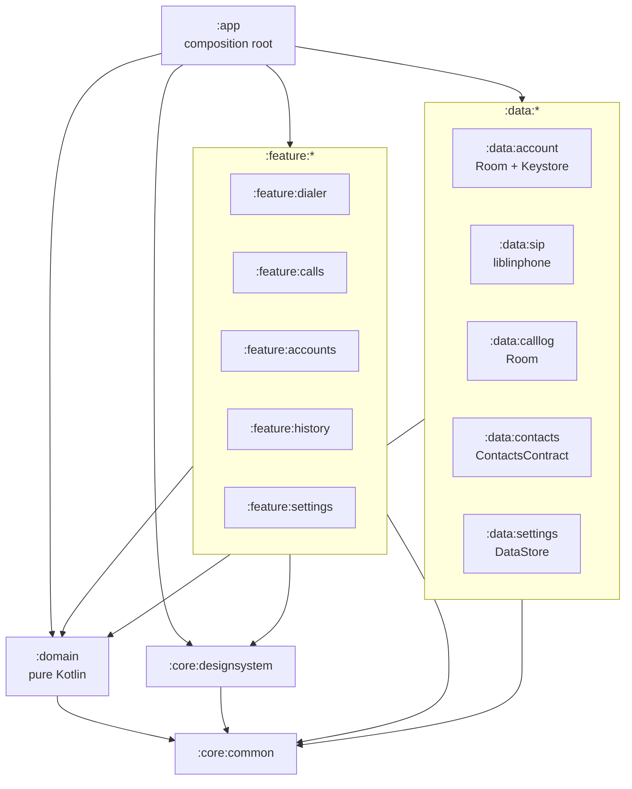
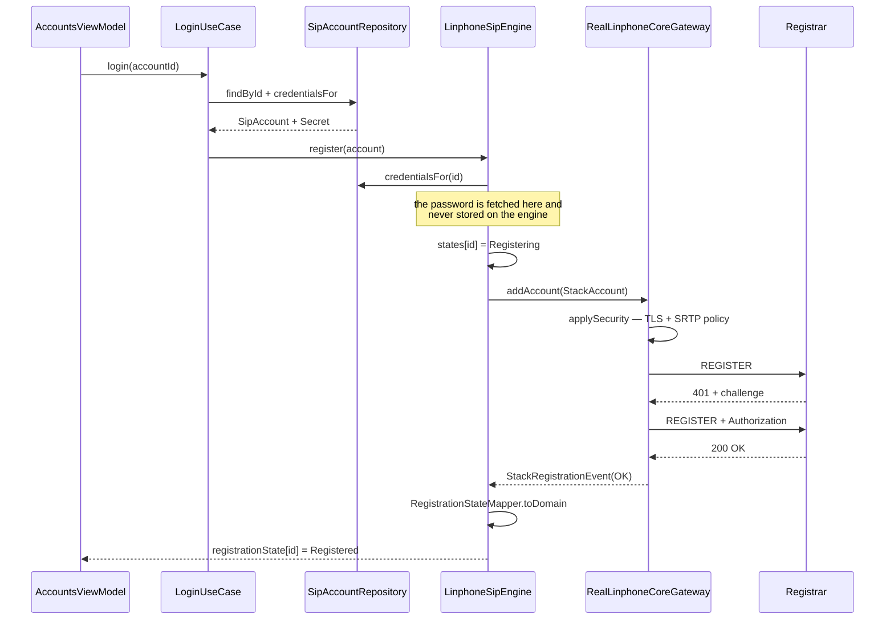
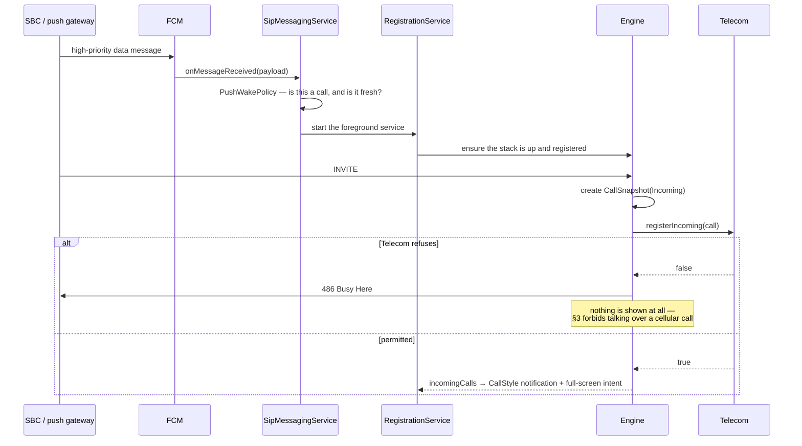
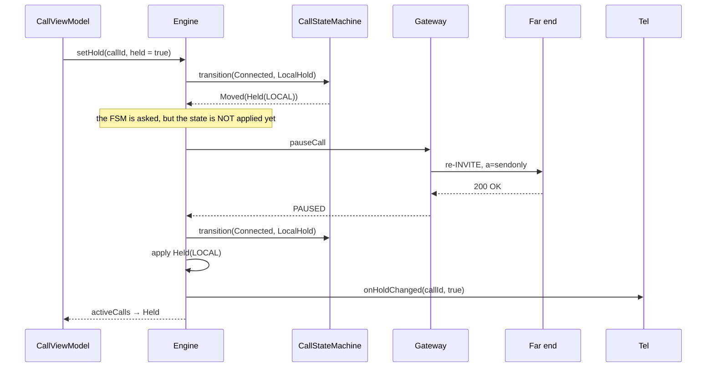
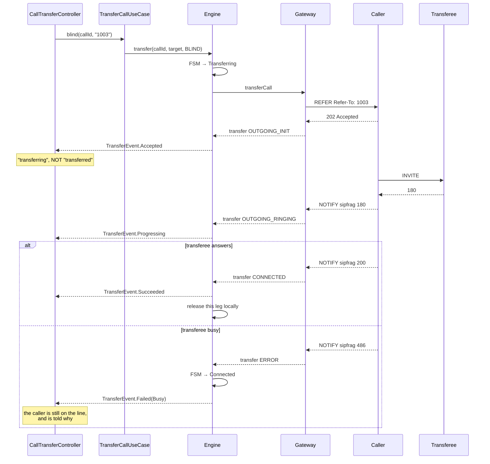

# Architecture — Native Android SIP Client

**Status:** Task 1 complete (decision record open). HLD sections — module graph, layer
diagram, sequence diagrams, threading model — are authored in **Task 67** and are
deliberately absent here rather than stubbed with placeholder content.

**Source of requirements:** [`../android-sip-app-prompt.md`](../android-sip-app-prompt.md)
**Task plan:** [`../tasks.md`](../tasks.md)

---

## 1. Decisions

Five decisions, four settled and one carried as an open cost item. Each records what was
decided, why, what it costs, and how to reverse it.

### ADR-001 — SIP stack: **liblinphone (linphone-sdk)**

**Status:** Accepted · **Decided:** 2026-09-04 · **Decider:** delegated to engineering

**Context.** `android.net.sip` was deprecated in API 31 and removed; a third-party stack
with native libraries is mandatory (§2.4). The realistic options are liblinphone
(Belledonne) and PJSIP/pjsua2 (Teluu). The target infrastructure is FreeSWITCH (ADR-003),
which interoperates well with both, so infrastructure does not decide it.

**Decision.** Embed **liblinphone / linphone-sdk**, consumed as a published AAR.

**Why, given this project's scope:**

1. **The scope is wide, not deep.** This project needs SIP + SRTP/ZRTP + video codecs
   (VP8/H.264) + Opus + ICE/STUN/TURN + adaptive bitrate, all working together.
   liblinphone ships that as one integrated, tested unit. PJSIP gives finer control over
   a narrower core and leaves more of the media pipeline to assemble.
2. **No NDK build pipeline to own.** liblinphone publishes an AAR with prebuilt `.so`
   files. PJSIP means building and maintaining your own cross-compilation for every ABI,
   plus re-doing it for each NDK and 16 KB page-size requirement (§3). That is a standing
   maintenance cost paid by every engineer who touches the build.
3. **Push is first-class in the SDK.** liblinphone models RFC 8599 push parameters
   directly, which is exactly the mechanism ADR-004 depends on. With PJSIP the `pn-*`
   Contact parameters must be assembled and maintained by hand.
4. **Video is the differentiator.** Phase 6 needs bidirectional video, camera switching,
   orientation handling, and mid-call escalation. liblinphone's video stack is the more
   complete of the two out of the box.

**What we give up.** Less control over the media path, a larger APK, and a heavier
dependency. Neither is decisive at this scope.

**Cost.** APK size increase — measure and record in Task 25. Licence: see ADR-002.

**Reversibility.** High, and deliberately so. The stack lives entirely behind the
`SipEngine` interface (§4.3) in `:data:sip`, enforced by an architecture test (Task 12,
DoD 3). Swapping to PJSIP is a rewrite of one module, not of the application.

**Distribution finding (2026-09-04).** liblinphone is **not published to Maven Central or
Google Maven** — a version query against both returns nothing for
`org.linphone:linphone-sdk-android`. It is hosted on Belledonne's own Maven repository.

That has two consequences worth deciding on before Task 25:

1. **A third-party Maven repository must be added** to `dependencyResolutionManagement`.
   The build currently allows only `google()` and `mavenCentral()`, with
   `FAIL_ON_PROJECT_REPOS` so no module can add its own. Adding a repository widens the
   supply chain, and the artifacts should be pinned by version and ideally verified by
   checksum.
2. **The OSV vulnerability gate will not see it.** OSV indexes the Maven ecosystem;
   an artifact served from a private repository has no advisories to match. The gate
   stays useful for everything else, but liblinphone's own security notices have to be
   tracked by subscribing to Belledonne's releases — a manual process, and it should be
   named as such rather than assumed covered.

**API facts, established by dumping the real 5.5.18 AAR** (not from memory):

- `org.linphone.core.Factory.instance()` is the entry point, and obtaining it is
  sufficient proof that the AAR resolved, the `.so` files for the device's ABI were
  found, and the JNI bridge initialised.
- **`Factory` has no version member.** `getVersion()` lives on `org.linphone.core.Core`,
  which requires configuration files to construct — so the stack version can only be
  logged once a `Core` exists, in Task 27.

**Verify in Task 25 before writing code against it** (§13 — ground every claim):
- Pin an exact linphone-sdk version and record the artifact coordinates **and the
  repository URL** here.
- Confirm the version's push-configuration API surface against its own release notes,
  rather than against this document.
- Confirm every bundled `.so` is 16 KB page-size aligned; if not, that is a blocker to
  raise immediately, not a workaround to invent.

---

### ADR-002 — Licence position: **GPLv3 working assumption, commercial licence UNRESOLVED**

**Status:** ⚠️ **Open — blocks release, not development** · **Owner:** needs a business decision

**Context.** The distribution model is not yet decided. liblinphone is dual-licensed:
**GPLv3 or a commercial licence from Belledonne Communications**. PJSIP is GPLv2 or
commercial from Teluu. There is no free closed-source path with either.

**Decision (provisional).** Develop against the **GPLv3 terms**. This is the assumption
that is safe to build under, because it constrains nothing during development and
converting *later* costs money but not code.

**The consequence, stated plainly:**

| Distribution model | Obligation |
|---|---|
| App source published under GPLv3 | No fee. Your entire app becomes GPLv3. |
| Shipped to customers, source closed | **Commercial licence required.** Typically a recurring annual fee. |
| Internal / single-client enterprise | Still distribution. Offer source to recipients, or licence commercially. |

**Why this is flagged rather than assumed away.** If the app ships closed-source, the
licence is a **purchase**, and discovering that after Phase 9 is an expensive surprise.
Nothing in Phases 1–8 depends on the answer, so development proceeds — but the answer is
needed before any external release.

**Action required (not by engineering):**
1. Decide the distribution model.
2. If closed-source: obtain a quote from Belledonne and budget it.
3. Have counsel review the GPLv3 path if it is chosen — note that GPLv3's installation-
   information and anti-tivoization terms interact with app-store distribution in ways
   worth checking. **This document is not legal advice.**

**Review date:** before Task 64 (release build). Escalate if unresolved by Phase 8.

---

### ADR-003 — Conference: **FreeSWITCH `mod_conference`, dial-in MCU**

**Status:** Accepted · **Decided:** 2026-09-04 · **Decider:** stakeholder (existing infrastructure)

**Context.** SIP is point-to-point; multi-party calling requires a conference focus
server-side (§2.2). A FreeSWITCH instance is already deployed and will be used.

**Decision.** **Dial-in MCU** (§2.2 option a) using FreeSWITCH `mod_conference`. The
client places one ordinary call to a conference URI; the server mixes and returns a
single stream.

**Why.** It follows from the infrastructure, and it is the recommended default anyway:
it works over baseline SIP with no signalling extension, needs one decode path on the
client, and keeps device CPU and battery cost flat as participants grow — which matters
on the mid-range Android hardware most users will have.

**What we give up.** No per-participant video layout control, and no client-side
selective forwarding. Active-speaker or grid layout is whatever the bridge composes.

**Reversibility.** Preserved by design. `ConferenceSession` (Task 59) models **N**
participant streams with no dial-in-specific assumption baked in, so moving to an SFU is
an implementation swap in `:data:sip`, not a domain rewrite.

**Verify before Phase 8 (Task 60):**
- Confirm the FreeSWITCH conference profile, the dial-in extension pattern, and the PIN
  policy on the deployed instance.
- Confirm whether the deployment publishes a **participant roster** the client can
  subscribe to. If it does not, Task 60's participant list shows what is actually known
  and says so — it does **not** render a fabricated list (§13).

---

### ADR-004 — Push wake path: **RFC 8599 client parameters + an ESL-driven push gateway**

**Status:** Accepted, with one item to verify · **Decided:** 2026-09-04 · **Decider:** delegated to engineering

**Context.** Android will not let a backgrounded app hold a SIP registration
indefinitely. A registration-only design misses incoming calls in Doze or after process
death; on Android 12+ push is the primary delivery path, not a fallback (§2.5).

**Decision — a two-part design, so the client is correct regardless of what the server
turns out to support:**

**Client side (build unconditionally).** Always send RFC 8599 push parameters on the
`Contact` header at `REGISTER`:

```
pn-provider = fcm
pn-param    = <FCM sender / project identifier>
pn-prid     = <FCM registration token>
```

This is the standard mechanism, it costs nothing if the server ignores it, and it means
the token reaches the server without a bespoke side channel. Token rotation triggers
re-registration (Task 38).

**Server side.** FreeSWITCH core **does not ship an FCM or APNs sender** — a push gateway
is required either way. Build a small service that:

1. Subscribes to the FreeSWITCH **Event Socket (ESL)**.
2. Detects an inbound call to an endpoint that is push-registered but not currently
   reachable on an open transport.
3. Sends an **FCM high-priority data message** to that endpoint's `pn-prid`.
4. Lets the INVITE proceed once the client re-registers.

**Server → app payload contract (normative — Task 38 implements exactly this):**

| Field | Type | Meaning |
|---|---|---|
| `call_id` | string | SIP `Call-ID` of the pending INVITE, for correlation |
| `account_id` | string | Which registered identity the call is for |
| `sent_at` | epoch ms | For staleness detection — drop if older than the ring timeout |
| `type` | enum | `incoming_call` (extensible: `missed_call`, `message_waiting`) |

**The payload carries no credentials and no call content.** Caller identity arrives in
the INVITE over the secured signalling channel, not in the push (DoD 12). The push says
only "wake up and re-register".

**To verify (Task 38, before implementing):** whether the deployed FreeSWITCH version
stores `pn-*` parameters in its sofia registrations — inspect a live registration
(`sofia status profile <profile> reg`) rather than assuming from version numbers. If it
does not retain them, the gateway reads tokens from its own store instead, and the client
side is unchanged. This is why the client half is built unconditionally.

**Consequence.** A backend component must be built and operated. It is small, but it is
real work outside this repo, and it is **out of scope for this app** (§11) — the app
consumes the contract above; it does not implement the gateway.

---

### ADR-005 — Test target: **the existing FreeSWITCH deployment; no local Docker server**

**Status:** Accepted, with a recorded risk · **Decided:** 2026-09-04 · **Decider:** stakeholder

**Decision.** Integration tests run against the already-deployed FreeSWITCH server.
Task 32 no longer builds a `docker/compose.yaml`; it configures and documents access to
the existing instance instead.

**What this buys.** Tests exercise the real production configuration — real dialplan,
real codec negotiation, real TLS certificates, real NAT topology. That is genuinely
higher-fidelity than a clean-room container, and it removes a maintenance burden.

**Risk accepted — stated so it is a choice, not an accident.** A shared remote server
means integration tests are **not** hermetic:

- Tests need network reachability to that host, so CI cannot run them in isolation.
- State is shared. Concurrent CI runs, or a colleague testing at the same time, can
  collide on the same extensions or conference room.
- The server cannot be reset to a known state between runs.
- A registrar-restart test (Task 33, DoD 6) means restarting a **shared** service.

**Mitigations, to settle in Task 32:**
1. Reserve extensions used **only** by automated tests, distinct from manual-testing ones.
2. Reserve a dedicated conference room number for Task 60.
3. Serialize integration-test runs (a CI concurrency group of 1) to avoid collisions.
4. For the registrar-restart case, prefer a client-side transport drop over restarting a
   shared service — and if a real restart is needed, run it as a scheduled manual test,
   not on every CI push.
5. Keep unit tests and `FakeSipEngine` journeys (DoD 4) as the CI gate. Integration tests
   run on a schedule or on demand. **This keeps CI fast and deterministic** and is the
   part of the Docker plan actually worth preserving.

**Reversibility.** High. Standing up a local FreeSWITCH container later is additive and
changes no application code. Revisit if CI flakiness from shared state becomes a drag.

---

### ADR-006 — Migrate the SIP stack to **PJSIP / pjsua2**, and how the binaries are sourced

**Status:** Requested, **BLOCKED on a sourcing decision** · **Raised:** 2026-09-07 ·
**Decider:** stakeholder · **Supersedes when accepted:** ADR-001

**Context.** The product owner requires the calling stack to move to the latest stable
PJSIP. ADR-001 chose liblinphone and explicitly weighed PJSIP against it; this reverses
that, so it is recorded here rather than applied quietly.

**What is verified, not assumed:**

| Fact | Value | Consequence |
|---|---|---|
| Latest stable pjproject | **2.17**, released 22 April 2026 | This is what "latest stable" means today |
| Official Android artifact | **None.** No `org.pjsip` group on Maven Central | The binaries must come from somewhere; see below |
| Documented Android build | `./configure-android` + `make` + SWIG `pjsua2` bindings | An NDK cross-compile this project would own |
| 16 KB page size | Requires **NDK r27 or later** | Mandatory for Android 15+ and for Play submissions |
| ABIs this app packages | `arm64-v8a`, `armeabi-v7a`, `x86_64` | Three cross-compiles per release |

**The blocking question — where do the `.so` files come from?** PJSIP is not consumable
the way liblinphone is. Three options, and they are not equivalent:

1. **Build pjproject 2.17 in CI from source.** The only route to genuinely *latest stable*
   PJSIP. `.github/workflows/build-pjsip.yml` is a first cut of it. Cost: a long native
   build, and OpenSSL and Opus must be cross-compiled too — a bare `configure-android`
   yields a stack with **no TLS and no Opus**, which fails DoD 13 and §5.2 outright. This
   is precisely the "assemble the media pipeline yourself" cost ADR-001 declined.
2. **A third-party repackaged AAR** — `com.pjdroid:pjdroid`, `com.cocolove2.library:pjsip`,
   `net.gotev:sipservice`. Fastest, and rejected on the evidence unless the stakeholder
   overrules: none is published by Teluu, each pins its own older pjproject rather than
   2.17, none documents 16 KB page-size support, and this is the component that holds SIP
   credentials and carries media. Shipping an unvetted native blob contradicts §7 and the
   "production-ready" requirement in the same breath as satisfying "use PJSIP".
3. **Vendor prebuilt `.so` files into the repository.** Removes the CI build but puts
   binaries in git that nobody can reproduce, and re-does the problem at every NDK bump.

**Scope, so the size is not a surprise.** The `SipEngine` seam means `:domain`,
`:feature:*` and `:app` are untouched — that is the payoff ADR-001 promised and it holds.
`:data:sip` is **4,821 lines of production code and 3,663 lines of tests**, and
essentially all of it is rewritten: the core gateway, registration, the call gateway,
video, recording, conference, and every state mapper.

**What this migration does *not* fix.** The four defects reported from the device on
2026-09-07 — the retained `ConnectionService`, mute, hold, and video — were all found to
be **above** the SIP abstraction, in `:app` and `:domain`. Every one of them would
reproduce identically on PJSIP. They are fixed separately, and that fix is what makes
1:1 audio and video calling work; this ADR is orthogonal to it.

**Recommendation.** Land the defect fixes and confirm calling on the handset first, then
take option 1 as its own tracked piece of work. Options 2 and 3 buy the PJSIP name
without the properties that made it worth asking for.

---

## 2. Settled inputs to the rest of the plan

| Question | Answer | Affects |
|---|---|---|
| SIP stack | liblinphone (linphone-sdk), version pinned in Task 25 | Tasks 25, 27 |
| Licence | GPLv3 assumed; commercial licence **unresolved** | Task 64, release |
| Conference server | FreeSWITCH `mod_conference` | Tasks 59, 60, 61 |
| Conference model | Dial-in MCU; domain shaped for SFU | Tasks 59, 60 |
| Push | RFC 8599 params + ESL push gateway (backend, out of scope) | Task 38 |
| Test target | Existing FreeSWITCH; no Docker | Tasks 32, 33, 46, 55–57, 60 |
| Concurrency framing | 5,000 is a server metric — client delivers backoff, jitter, keepalive economy (§2.1) | Tasks 26, 30 |

## 3. Open questions

Tracked, not guessed (§13). Each names an owner and a deadline.

| # | Question | Owner | Needed by |
|---|---|---|---|
| Q1 | Distribution model — closed-source, internal, or open? Drives ADR-002. | Business | Before Task 64 |
| Q2 | If closed-source: is the Belledonne commercial licence budgeted? | Business | Before release |
| ~~Q3~~ | ~~FreeSWITCH hostname, SIP domain, transport, and TLS CA~~ — **answered, see §3.1** | Infra | ~~Task 32~~ |
| ~~Q4~~ | ~~Test extensions to reserve for automation, and a conference room~~ — **answered, see §3.1** | Infra | ~~Task 32~~ |
| Q5 | Does the deployed FreeSWITCH retain `pn-*` params in sofia registrations? | Infra | Task 38 |
| Q6 | Who builds and operates the ESL push gateway? It is outside this repo. | Eng lead | Before Task 38 |
| Q7 | Does the conference profile publish a participant roster? | Infra | Task 60 |
| Q8 | Is call recording actually required, and in which jurisdictions? Drives the consent model in §2.6. | Legal / Product | Before Task 58 |
| Q9 | Enable SIP TLS on the test target: run `gentls_cert`, set `internal_ssl_enable=true`. Until then Task 33 covers UDP and TCP only. | Infra | Task 33 |

### 3.1 Q3 and Q4 — the test target, answered

Read from the deployed instance's own configuration rather than agreed in the abstract,
so every value here is checkable: `/usr/local/freeswitch/etc/freeswitch` on the
development machine, FreeSWITCH **1.10.11-release**.

| | Value | Where it comes from |
|---|---|---|
| SIP domain / host | the machine's LAN address | `vars.xml` → `domain` |
| SIP port | **5060**, UDP and TCP | `vars.xml` → `internal_sip_port` |
| TLS port | 5061, **but TLS is off** | `vars.xml` → `internal_ssl_enable=false` |
| Extensions | **1000–1019**, password inherited from `default_password` | `directory/default/10*.xml` |
| Reserved for automation | **1018 and 1019** | this document; see below |
| Conference room | **3000**, the stock `mod_conference` dial-in extension | `dialplan/default` |

**No value that identifies or authenticates is written down here.** The host is a LAN
address that changes with the network, and the password is a credential. Both are injected
at build time from Gradle properties or CI secrets and neither is committed — Task 32's
fourth done-when, enforced by a CI step that greps for them. `docs/testing.md` says how to
supply them.

**Two extensions are reserved for automation and are not to be used by hand.** ADR-005
accepted a shared, non-hermetic server; the mitigation is that automation owns 1018 and
1019 exclusively, so a manual test signed in on a handset cannot make an automated run
fail and leave no trace of why. 1000–1017 are for manual use.

**TLS is not currently available, and Task 33 cannot claim it.** The internal profile has
`internal_ssl_enable=false` and `tls/` holds only the DTLS-SRTP and WSS certificates —
there is no SIP TLS certificate. UDP and TCP registration can be tested today; the TLS leg
of Task 33's first done-when needs `gentls_cert` run against the server and the profile
flipped, which is a change to the deployment and is **Infra's to make, not this repo's**.
Recorded as Q9 rather than quietly dropped.

## 4. HLD

Authored in Task 67, from the code as built rather than from the plan as written. Where
the two differ, the code wins and the difference is called out.

### 4.1 Module graph



**The two edges that are absent are the design.** No `:feature:*` depends on any
`:data:*`, and nothing depends on `:app`. A feature that reached into a data module would
bypass the repository interface and every test seam `:domain` exists to provide;
architecture Rule 3 fails the build if one appears.

`:domain` applies **no Android plugin at all** — it is a JVM library (DoD 2). That is not
a stylistic preference: it is what makes the call state machine, the backoff, the call
waiting order and the recording consent gate testable as pure functions, and it is
asserted twice, by an architecture rule and by a CI step that tries to add an Android
dependency to it and expects the build to fail.

### 4.2 Layers, and what each may know

| Layer | May depend on | Must never |
|---|---|---|
| `:app` | everything | be depended upon |
| `:feature:*` | `:domain`, `:core:*` | import a `:data:*` module or a SIP type |
| `:data:*` | `:domain`, `:core:common` | decide platform policy, or import another `:data` module |
| `:domain` | `:core:common` | import anything from Android |
| `:core:*` | nothing but each other | know what a SIP call is |

Three ports run the other way, and they are the whole of how `:domain` reaches the
platform without importing it:

| Port (in `:domain`) | Implemented by | Because |
|---|---|---|
| `PlatformCallRegistry` | `:app` — Telecom | only the platform knows about the cellular call this app cannot see |
| `CameraAvailability` | `:app` — permissions + `PackageManager` | "declined" and "no hardware" are both Android questions with one answer |
| `VideoSurfaceController` | `:data:sip` — the stack's renderer | a surface is an Android view; it crosses the boundary opaque |
| `SipAccountRepository`, `CallLogRepository`, `ContactRepository`, `CallRecorder` | `:data:*` | storage is an implementation detail of an interface the domain owns |

### 4.3 Threading model

| Work | Where it runs | Why |
|---|---|---|
| liblinphone callbacks | the stack's own iteration thread | published to a buffered `SharedFlow` immediately and handled elsewhere — a blocked callback stops SIP processing entirely |
| Engine bookkeeping | `@SipStackScope` — `SupervisorJob` + `Dispatchers.IO` | everything on it is a socket or a stack callback waiting on one, never computation; `SupervisorJob` so one failed collector cannot take every account's recovery down with it |
| Room and DataStore | their own dispatchers, inside `:data:*` | a repository that made its caller choose a dispatcher would leak its storage choice |
| ViewModels | `viewModelScope` (main) | state assembly only; every suspending call below is main-safe by contract |
| Domain | the caller's | pure functions and suspending seams; `:domain` starts no coroutine of its own |

**Every `suspend` function on `SipEngine` is main-safe**, stated in its contract and
honoured by moving to the engine's own dispatcher internally. Callers need no
`withContext`, which is what keeps `viewModelScope.launch { engine.answer(...) }` correct
rather than merely conventional.

### 4.4 Registration



The state is reported as `Registering` the moment the user presses save, before any
network round trip — a screen that shows nothing until the registrar answers reads as a
button that did nothing.

### 4.5 Outgoing call


### 4.6 Incoming call, woken by push



The payload carries **no credential and no caller identity** — only "wake up and
re-register" (ADR-004). A push that carried the caller would be a caller disclosed to
Google.

### 4.7 Hold and resume



**The state moves when the stack says so, not when the button is pressed.** A call shown
as held whose re-INVITE the far end refused with a 488 is a screen lying about where the
audio is going.

### 4.8 Transfer



An attended transfer differs in two places only: call A is held and B is consulted first,
and the REFER carries `Replaces` naming B's dialog — which is why the gateway takes a
*call* rather than an address for that one.

### 4.9 Where each DECIDE is answered

| §2 DECIDE | Answer | Section |
|---|---|---|
| §2.2 — conference server and model | FreeSWITCH `mod_conference`, dial-in MCU, domain shaped for SFU | ADR-003 |
| §2.4 — which SIP stack | liblinphone (linphone-sdk) 5.5.18, GPLv3 assumed; a move to PJSIP 2.17 is requested and blocked on sourcing | ADR-001, ADR-002, ADR-006 |
| §2.5 — push model | RFC 8599 `pn-*` client params + an ESL-driven gateway; four-field payload contract | ADR-004 |

DoD 15 asks for every DECIDE to be answered here. All three are, each with a rationale and
with what remains unresolved named as an open question rather than assumed away.
