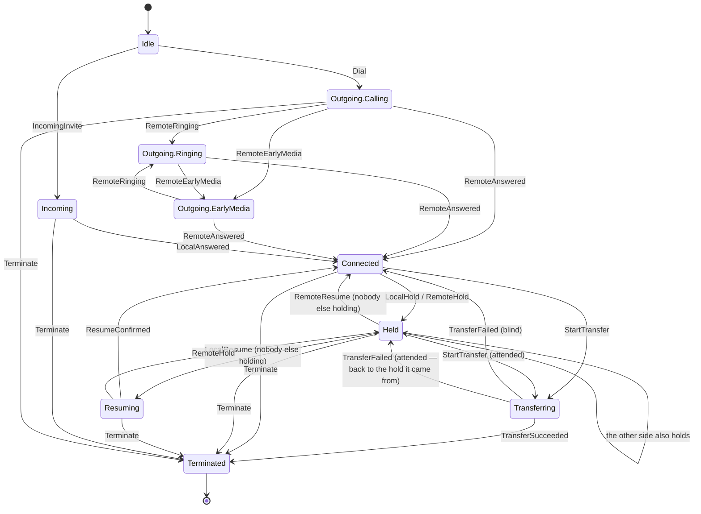

# Low-level design

Written in Task 67, from the code as built. Where a name here does not exist in the tree,
that is a defect in this document — everything below is checkable with a grep.

Companion documents: [`architecture.md`](architecture.md) for the HLD, the module graph
and the sequence diagrams; [`security.md`](security.md) for credentials, transport and
recording; [`testing.md`](testing.md) for how to run any of it.

---

## 1. The call state machine

The single most important object in `:domain`. Pure, stateless, and exhaustively tested:
`CallStateMachineTest` enumerates every (state, event) pair and asserts that every pair
**absent** from its table is rejected, so adding a transition without documenting it fails
the build.

### The four decisions inside it

**`HoldParty`, not a boolean.** Both ends can hold at once. With a boolean, resuming from
`Held(BOTH)` returns `Connected` while the far end is still holding, and the audio does not
come back — the "resume did nothing" bug, shipped.

**Controls are attributes, not states.** Mute, audio route, video and recording each vary
independently and none changes what the call may do next. Folding them into `CallState`
would multiply the state count by sixteen and make the table unreadable, for nothing.

**`Transferring` remembers where it came from.** An attended transfer sends its REFER from
a *held* call. Without `heldBy`, a failed one returns to `Connected` — a screen claiming
audio is flowing while the far end still holds.

**Rejection is a value, not a null.** `TransitionResult.Rejected` carries the state and the
event that was refused, so "the UI offered an action the call could not perform" surfaces
in a test rather than being swallowed at run time.

---

## 2. `SipEngine` — the contract

The seam between the application and PJSIP (§4.3, ADR-006). Everything above it is written
against `:domain` types and can be built, run and tested with `FakeSipEngine` — no server,
no network, no device. It splits into four role interfaces so a ViewModel that only toggles
the speaker does not have `transfer` in scope.

| Role | What it owns |
|---|---|
| `SipRegistrar` | `registrationState`, register / unregister / refresh, RFC 8599 push params |
| `SipCallController` | `activeCalls`, `incomingCalls`, `endedCalls`, `transferEvents`; place, answer, reject, hangup, hold, DTMF, transfer |
| `SipMediaController` | mute, audio route, video enable, camera switch, `videoRequests` + `respondToVideoRequest` |
| `SipConferenceController` | `conferences`, `joinConference` |

### The five promises, and why each exists

1. **Only `:domain` types cross it.** No `org.pjsip.*` anywhere above `:data:sip` — and
   and no import of the removed stack anywhere at all, since ADR-006 —
   enforced by architecture Rule 2 and a CI step. This is what makes `FakeSipEngine` a
   drop-in rather than an approximation.
2. **Every `suspend` function is main-safe.** Implementations move to their own dispatcher
   internally, so no caller needs `withContext`.
3. **Cancelling abandons the result, not the SIP transaction.** A cancelled `placeCall` may
   still have put an INVITE on the wire; the call appears in `activeCalls` regardless.
   Never assume cancelling the call to this interface cancelled the call.
4. **Errors are values.** `Outcome<T, SipError>`, not exceptions. A dropped registration is
   an expected outcome of a mobile network, and a caller that can forget a `catch` will.
5. **Idempotence.** Unregistering an unregistered account, or hanging up an ended call,
   succeeds quietly — the outcome the caller wanted is already true.

### The three streams that never replay

`incomingCalls`, `endedCalls` and `transferEvents` are `Flow`, not `StateFlow`, and are
buffered rather than replayed. Replay would re-ring a call answered minutes ago, write a
second call-log row on every re-collection, and raise a second alarm about a transfer that
already failed. Dropping would lose the missed call nobody was collecting for — which is
precisely the call that matters — so the buffer is 64, far more than a phone will ever have
at once.

### Error taxonomy

`SipError` has one case per thing a user can be told, and `CallMessages` gives each exactly
one sentence. Both `when`s are exhaustive with **no `else`**, so the compiler refuses a new
case until somebody has decided what the user is told about it.

| Group | Cases | Becomes |
|---|---|---|
| Authentication | `AuthenticationFailed`, `Forbidden` | a message naming the credential or the permission |
| Addressing | `NotFound`, `BadRequest` | "that address does not exist" / "could not be dialled" |
| Callee state | `Busy`, `Declined`, `TemporarilyUnavailable`, `Timeout`, `Cancelled` | distinct sentences — a busy line is not a refusal |
| Server | `ServiceUnavailable`, `ServerError` | `Retry-After` is honoured by the backoff, never read out |
| Media | `MediaNegotiationFailed(encryptionRequired)` | an SRTP failure says so; reporting it as "no shared codec" would hide the part that matters |
| Transport | `TransportFailure`, `NetworkUnavailable` | "could not reach the server" / "no connection" |
| Local | `UnknownAccount`, `UnknownCall`, `InvalidState`, `EngineUnavailable`, `CallNotPermitted` | states rather than failures |

`HangupReason` is the parallel vocabulary for the **call log**, and they are deliberately
different: a 486 is `BUSY` in the log and "that line is busy" on screen, but a 404 is a
terminated call in the log and "that address does not exist" on screen.

---

## 3. Class responsibilities

Only the classes that hold a decision. Anything absent is plumbing.

### `:domain` — pure, no Android

| Class | Responsibility |
|---|---|
| `CallStateMachine` | (state, event) → state. The authority on what a call may do next |
| `CameraPolicy` | Given **every** call, who holds the camera. Not "should this call release it" |
| `CallWaitingPolicy` | The ordered steps for a second call and for a swap. Order is the requirement |
| `RecordingPolicy` | The one gate in front of a recording (§2.6) |
| `RegistrationBackoff` | Exponential with jitter. No clock, no I/O |
| `RegistrationRecoveryPolicy` | What a network change means for one account. Never retries what a user must fix |
| `ExpiryRefreshPolicy` | When to re-REGISTER before a binding lapses |
| `AccountValidator` | Every §5.1 field rule, as data |
| `DialledTarget` | `1002` and `sip:1002@domain` are the same destination |
| `SrtpPolicy.permits` | DoD 13, as a function of two values |
| `ConferenceSession` | N participants, SFU-ready; `rosterAvailable` separates "empty" from "unknown" |

### `:data:sip`

| Class | Responsibility |
|---|---|
| `PjsipSipEngine` | Bookkeeping and orchestration. Holds no rule that could live in `:domain` |
| `RealPjsipCoreGateway` | **The only class that names the SDK.** Callbacks → buffered flows; every call into PJSIP confined to one registered thread |
| `CallStateMapper` | Stack call states → FSM events. Pure, so it is testable off-device |
| `TransferEventMapper` | REFER progress → `TransferEvent`. The 202 is *accepted*, never *succeeded* |
| `ConferenceMapper` | Bridge roster → `ConferenceSession`, preserving "no roster" |
| `RegistrationStateMapper` | Stack registration states → `RegistrationState` |
| `RegistrationRecoveryCoordinator` | Owns the retry timers; asks `RegistrationRecoveryPolicy` what to do |
| `PjsipCallRecorder` | Gate, lifecycle, indicator. Never chooses where bytes go |
| `EncryptedRecordingStore` | AES-GCM under a Keystore key; deletes the plaintext before reporting success |

### `:app`

| Class | Responsibility |
|---|---|
| `TelecomCallRegistry` | The `PlatformCallRegistry` port, backed by `ConnectionService` |
| `SipConnectionService` / `SipConnection` | Telecom's side of a self-managed call |
| `RegistrationService` | Foreground service; renders the call **and** the registration summary in one notification |
| `ForegroundServiceTypes` | Which FGS types are true *and permitted* right now (Android 14) |
| `ServiceRunPolicy` | Whether the service should exist at all (§6) |
| `CallAudioCoordinator`, `AudioRoutePolicy`, `ProximityLock` | Routing, focus, and the screen-off lock |
| `PushWakePolicy`, `SipMessagingService` | The FCM wake path (ADR-004) |
| `AndroidCameraAvailability` | "No camera" and "declined" answered as one boolean |

---

## 4. Room schemas

Both databases export their schema to `schemas/` and both are committed — CI fails if they
drift. Without an exported schema Room cannot verify a migration, and a schema change ships
as silent data loss instead of a build error.

### `sip_accounts` (`:data:account`, version 1)

25 columns; one row per configured account. The ones that matter:

| Column | Note |
|---|---|
| `id` | Primary key; an app-generated UUID, never the SIP identity |
| `password_ciphertext` | **AES-GCM, never plaintext.** See `security.md` |
| `turn_password_ciphertext` | Same treatment; a TURN credential is a credential |
| `username` + `domain` | **Unique index.** Two bindings for one identity fight over one registrar record |
| `is_default` | Indexed; exactly one row is default, maintained on write |
| `srtp_policy`, `transport` | Per account, because one identity may mandate SRTP and another cannot do it |

### `call_log` (`:data:calllog`, version 1)

12 columns; one row per call, including the ones that never connected.

| Column | Note |
|---|---|
| `started_at_epoch_millis` | Indexed — the log is read newest-first, always |
| `direction` + `answered_at_epoch_millis` | Composite index; this pair *is* the "missed" filter |
| `answered_at_epoch_millis` | Null means never answered. That is the missed-call definition, not a flag |
| `contact_name` | Resolved at write time and **never leaves the device** (architecture Rule 9) |
| `reason` | The `HangupReason`, so a failed call says why rather than merely ending |

Settings live in DataStore rather than Room (`:data:settings`): they are a handful of
scalars with no relationships, and a database for them would be a migration surface for
nothing.

---

## 5. What is deliberately not here

- **A DI diagram.** Hilt's graph is the sum of the `@Module`s, and a drawing of it is
  stale the day a binding moves. `HiltGraphTest` asserts the graph builds and resolves,
  which is the property a diagram would be trying to claim.
- **Per-class UML.** The KDoc on each class says why it exists; a diagram that repeats the
  class list adds a second thing to keep in step.
