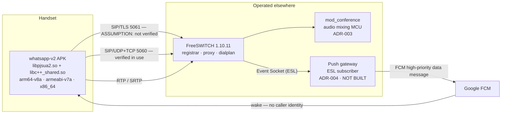
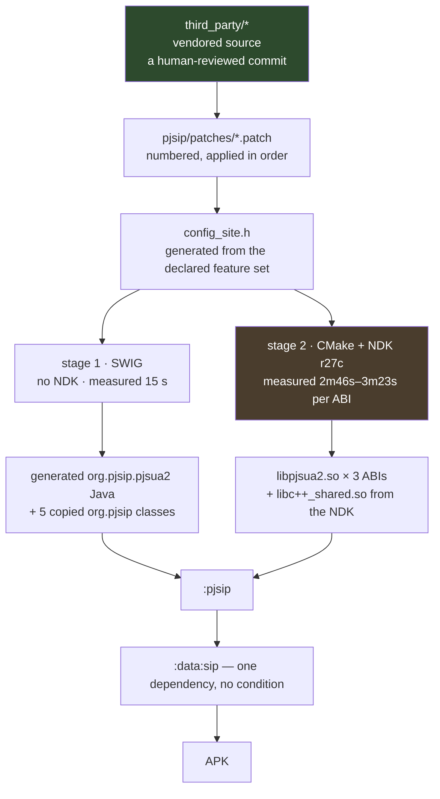

# System design — beyond the APK

**Master prompt §8.** The APK is one node. This is the system it lives in: topology,
capacity arithmetic, failure domains, observability, rollout.

Every number here is either measured with its method stated, or labelled `ASSUMPTION:`.
No conclusion is asserted without the arithmetic beside it.

---

## 1. Topology



### 1.1 The contract with each component this app does not build

| Component | What this app sends | What it must send back | If unavailable |
|---|---|---|---|
| **Registrar** (FreeSWITCH sofia) | `REGISTER` with RFC 8599 `pn-provider=fcm`, `pn-param`, `pn-prid` on the `Contact` header (`docs/architecture.md:137-143`) | 200 with an expiry; 401/407 to challenge; 503 **with `Retry-After`** | Backoff per §3.3 of `docs/data-structures.md`; the user sees "could not reach the server" |
| **Proxy / dialplan** | `INVITE` with an SDP offer over the negotiated transport | 100/180/200 or a final failure code | `SipError.TransportFailure`; no call is placed |
| **MCU** (`mod_conference`, ADR-003) | An `INVITE` to the dial-in URI | Mixed audio, and roster events | Conference join fails as an ordinary call failure |
| **Push gateway** (ADR-004) | Nothing directly — it reads the ESL | An FCM data message carrying `call_id`, `account_id`, `sent_at`, `type` and **nothing else** (`docs/architecture.md:160-163`) | **Silent.** See §4.3 — this is the failure with no natural detector |
| **FCM** | Nothing | Delivery of the above | Same silence |

**What the push must NOT send: the caller.** ADR-004's position is that a push carrying the
caller is a caller disclosed to Google (`docs/architecture.md:165-167`). Caller identity
arrives in the INVITE over the secured signalling channel. The push says only "wake up and
re-register".

### 1.2 The build pipeline is part of the topology

Under the native mandate, the supply chain for the most sensitive component in the system —
the one that holds SIP credentials and carries media — becomes a diff in this repository.
**That is the strongest security claim the project has**, and it is worth stating plainly.



**Trust boundaries, marked:**

- **Source enters at a human-reviewed commit**, not a build-time download. That is the
  boundary N-2 moves, and the whole point of it: today four `curl` invocations
  (`.github/workflows/build-pjsip.yml:85, 271, 281, 293, 328`) put unreviewed bytes into the
  build.
- **The toolchain is pinned and exempt** (master prompt §2.1.1): NDK **r27c**
  (`.github/workflows/build-pjsip.yml:207`), plus CMake, Ninja, autotools, SWIG, Python and
  the JDK. Every one is listed in `docs/native-dependencies.md`. An unpinned tool is a
  silently different `.so`.
- **Artifacts are cached in GitHub Actions**, or — see §3.5 — are not cached at all, because
  the measured build does not need it.
- **Who can publish:** whoever can merge to `main`. There is no second gate on the native
  output, and there does not need to be, because there is no longer a binary that bypasses
  the diff.

---

## 2. Capacity — SHOW YOUR WORKING

### 2.1 Bandwidth per call, per codec, both directions

**The overhead, computed once.** IPv4 + UDP + RTP headers are 20 + 8 + 12 = **40 bytes**
per packet. At the standard 20 ms packetisation that is 50 packets/second:

```
40 bytes × 50 pps × 8 bits = 16,000 bits/s = 16 kbps of pure header, per stream, per direction
```

| Codec | Payload | + 16 kbps header | One direction | **Both directions** | Available here? |
|---|---|---|---|---|---|
| PCMU / PCMA | 64.0 kbps | 80.0 | 80.0 kbps | **160 kbps** | **Yes** — the only audio codec that negotiates today |
| G.722 | 64.0 kbps | 80.0 | 80.0 kbps | 160 kbps | Compiled; **no peer** |
| G.729 | 8.0 kbps | 24.0 | 24.0 kbps | 48 kbps | Server offers it; **not in `CodecPreferences.DEFAULT`** |
| Opus @ 24 kbps | 24.0 kbps | 40.0 | 40.0 kbps | 80 kbps | Compiled; **no peer** |
| Opus @ 16 kbps | 16.0 kbps | 32.0 | 32.0 kbps | 64 kbps | Same |
| **Lyra @ 9.2 kbps** | 9.2 kbps | 25.2 | 25.2 kbps | 50.4 kbps | Not compiled |
| **Lyra @ 6 kbps** | 6.0 kbps | 22.0 | 22.0 kbps | 44 kbps | Not compiled |
| **Lyra @ 3.2 kbps** | 3.2 kbps | **19.2** | 19.2 kbps | **38.4 kbps** | Not compiled |
| VP8 @ 512 kbps | 512 kbps | ~528 | 528 kbps | 1056 kbps | **Yes** |

**The Lyra row is the whole argument for Lyra, and it says two things at once.**

At 3.2 kbps the header is **16 kbps against a 3.2 kbps payload — the overhead is five times
the audio.** That is a real result about **ptime**, not a reason to drop the codec: raising
packetisation from 20 ms to 60 ms cuts the packet rate from 50 to 16.7 pps and the header
from 16 kbps to 5.3 kbps, which takes the same call from 19.2 kbps to **8.5 kbps** one
direction. *The codec choice is worth less than the ptime choice at this bitrate*, and any
Lyra deployment that leaves ptime at 20 ms has spent a neural codec to save 40% instead of
78%.

**And the comparison is not against Opus.** `docs/reconciliation.md` A-1b establishes that
the deployed server offers **no Opus and no G.722**. So on this deployment the real
comparison is **Lyra at 3.2 kbps against G.711 at 64 kbps**:

```
160 kbps (G.711, both directions)  ÷  38.4 kbps (Lyra 3.2, both directions)  =  4.2×
and at 60 ms ptime:  160 ÷ 17.0  =  9.4×
```

**Master prompt §8.2 requires this row computed under either exit of the §2.4 gate**, and
this is why: on Exit B it is the arithmetic that says what reopening the question would be
worth. A 4.2× to 9.4× reduction against what the deployment actually negotiates is a
materially stronger case than the "order of magnitude under Opus" framing, because Opus is
not on the table here.

**The cheaper decision available first.** `mod_opus` is configured in FreeSWITCH's
`modules.conf.xml` and its `.so` is simply not installed
(`docs/reconciliation.md` A-1b). Installing it takes the same call from 160 kbps to 80 kbps
— **half** — with no client change at all, because the APK already compiles and registers
Opus. **DECIDE: do that before spending a week on Lyra.**

### 2.2 Concurrency ceiling of the deployed server

**Measured 2026-09-09** from
`/usr/local/freeswitch/etc/freeswitch/autoload_configs/switch.conf.xml`:

| Parameter | Value | What it bounds |
|---|---|---|
| `max-sessions` | **1000** | Concurrent call legs, not users |
| `sessions-per-second` | **30** | New session setup rate |

**ASSUMPTION:** this is the ADR-005 deployment, not a second instance. Confirm before these
numbers are quoted anywhere that matters.

**Both are below a 5,000-concurrent-user target**, and `max-sessions` counts *legs*: a
1:1 call is 2 legs, and a conference participant is 1 leg plus the MCU's. So 1000 sessions
is **500 concurrent 1:1 calls**, not 1000.

**What the client does when it is hit, and what the user sees.** A ceiling with no
client-side behaviour attached is a ceiling that produces a mystery. FreeSWITCH refuses
past `max-sessions` with a **503 Service Unavailable**, which the client already maps to
`SipError.ServiceUnavailable` (`docs/lld.md` error taxonomy). The user sees the
`ServiceUnavailable` sentence from `CallMessages`; the backoff honours any `Retry-After`
(`RegistrationBackoff.kt:78-81`).

**The gap:** a 503 from *capacity* and a 503 from *the registrar restarting* are the same
code and the same message, and they want different user copy — "the system is busy, try
again" versus "reconnecting". **DECIDE, unanswered:** whether that distinction is worth
carrying. It cannot be made from the response code alone.

### 2.3 Registration load

The full arithmetic is in `docs/data-structures.md` §3, because it is what justifies the
backoff parameters and the two must agree. In summary:

- **Steady state** at 5,000 users and a 600 s expiry: `5000 / 600` = **8.3 REGISTER/s**,
  which is **28% of the 30/s ceiling before any call is placed**.
- **Restart burst** with no backoff: 5,000 at once = **167× the ceiling**.
- **With the shipped full-jitter backoff** (base 2 s, ceiling 1800 s): the fleet does not
  drop under 30/s until **retry 7**, ~8.5 minutes of cumulative expected delay.

**The finding, stated plainly: `sessions-per-second = 30` is the mis-set parameter, not the
client's base delay.** Raise the server ceiling and re-measure before touching
`RegistrationBackoff`. Full reasoning and the rejected alternatives are in
`docs/data-structures.md` §3.3.

### 2.4 Conference scaling

`mod_conference` mixes audio at the MCU, so **audio conferencing is CPU-bound per
participant** — the mixer produces one unique output stream per participant (each hearing
everyone but themselves), which is O(n) mixes for n participants, plus O(n) decodes.

Video is not mixed by `mod_conference` in this configuration; it is relayed, so **video
conferencing is bandwidth-bound per participant** — n streams in, n-1 out per participant.

**Which the deployment is limited by:** with `max-sessions = 1000` as the hard stop, and
audio-only conferences, the MCU's CPU is the binding constraint well before the session
count is. **ASSUMPTION:** not measured. No conference has been run with three real clients
(`docs/dod-sweep.md:33` item 11 — "PARTIAL, three clients never run"). **This row is
arithmetic about the shape of the load, not a capacity figure**, and it must not be quoted
as one.

### 2.5 Build capacity — measured, and it changes the design

**Measured** from GitHub Actions run `34317978694`, 2026-09-09
(`docs/reconciliation.md` B-7):

| Job | Wall clock |
|---|---|
| Generate the pjsua2 Java API (SWIG) | **15 s** |
| pjproject 2.17 · arm64-v8a | **2m51s** |
| pjproject 2.17 · x86_64 | **3m23s** |
| pjproject 2.17 · armeabi-v7a | **2m46s** |
| Assemble pjsua2.aar | 1m20s |
| Build the app APK | 2m21s |
| **Total, end to end** | **7m18s** |

The three ABI jobs run in parallel, so total per commit is bounded by the slowest ABI plus
the serial packaging steps.

**Master prompt §2.3 estimates "roughly an hour per ABI" and designs a content-hash cache
scheme on that basis — including a 10 GB GitHub-cache ceiling analysis and a per-ABI key
split contingency. The estimate is high by a factor of about twenty.**

**SHOW YOUR WORKING on what the mandate adds to 7m18s:**

| Change | Effect on wall clock |
|---|---|
| Vendored source replaces four `curl` + `tar` steps | **Faster.** Removes four downloads |
| SWIG runs per build instead of being committed (N-13) | **+15 s**, measured |
| Lyra built per ABI — **Exit A only** | **The only hour-scale addition.** Bazel + TFLite |

**Conclusion, and it is a design decision the measurement makes for us:** on **Exit B** of
the §2.4 gate, the content-hash cache of §2.3 solves a problem that does not exist, and the
honest deliverable is to say so rather than build it. A seven-minute build needs no cache;
a cache that is not needed is a cache that can go stale, thrash, or be populated by hand —
all of which are ways the prebuilt binary comes back.

On **Exit A** a cache becomes necessary, and it should be scoped to **the Lyra prefix
alone**, not to pjproject. **DECIDE for phase 3b, from this measurement rather than from
the estimate.**

**And the cache-key question the master prompt asks — "name one change the key would not
invalidate".** If a cache is built, keyed on a content hash of `third_party/` + the patch
set + the NDK version + the feature flags, then: **a change to the SWIG version does not
invalidate it.** SWIG is not in the key, it is not in `third_party/`, and
`pjsip/api/build.gradle.kts:25-27` records that it is currently "whatever `apt-get install
swig` gives the runner" — an unpinned input. That is exactly the drift N-13 exists to
remove, and it is why §2.1.1's "pin every exempt tool" is not a formality.

---

## 3. Failure domains

For each: blast radius, detection, client behaviour, user-visible behaviour, recovery.

| Domain | Blast radius | Detection | Client behaviour | User sees | Recovery |
|---|---|---|---|---|---|
| **Registrar restart** | Every client at once | REGISTER fails / transport drops | Full-jitter backoff, `Retry-After` honoured | "Reconnecting" | ~8.5 min to fleet-wide recovery at 5,000 clients (§2.3) — **too slow; §2.3 says why** |
| **Proxy unreachable** | Every call | INVITE timeout | `SipError.TransportFailure`; registration unaffected | "Could not reach the server" | On the next successful INVITE |
| **Push gateway down** | Every *incoming* call | **None today.** See §3.1 | — | **Nothing. Calls simply never arrive** | Unbounded |
| **MCU at capacity** | Conference joins only | 503 on the dial-in INVITE | Ordinary call failure | "The system is busy" | Immediate on retry |
| **TLS cert expiry / rotation** | Every TLS account | Handshake failure | `SipError.TransportFailure`; **must not downgrade** | "Could not reach the server" | Server-side |
| **NAT binding timeout** | One client | Inbound stops arriving; keepalive fails | Re-register | Possibly nothing, if it recovers inside a ring | Seconds |
| **Carrier handover** | One client, mid-call | `ConnectivityManager`, coalesced and debounced | Re-register on the new identity; IP-change path for the media | A brief gap | Seconds |
| **Doze / App Standby** | One client | — | Push is the primary delivery path on Android 12+ (ADR-004) | Nothing, if push works | Depends entirely on the gateway |
| **Native library missing or ABI-mismatched** | Every install on that ABI | Today: `pjsip/build.gradle.kts:46` warns at *configuration* time | Today: the APK installs and dies on the first call | `UnsatisfiedLinkError` crash | — |
| — under the mandate | Same | **The build fails** (N-14, DoD 24); startup inventory is the second line | No such APK exists | — | — |
| **Codec negotiated but not decodable** | One call | Media flows, nothing is heard | §5 of `docs/data-structures.md` §4 audit | Silence | — |
| **Native build broken on `main`** | **Every build, including the one you would ship the fix with** | CI red | — | — | Revert the commit; vendoring makes a dependency bump revert like any other commit (N-7) |
| **A vendored dependency with a published CVE** | Every install | **See §3.2 — this is the one with no default answer** | — | — | Patch or bump, both reviewable diffs |

### 3.1 The push gateway is a single point of failure, and its failure is silent

**Named here rather than discovered at 3am.**

Every incoming call to a backgrounded client on Android 12+ depends on it (ADR-004,
`docs/architecture.md:125-128`). It is **not built** — ADR-004 places it explicitly out of
scope for this repository (`docs/architecture.md:174-177`).

**The failure mode that makes it worth its own section: everything looks healthy.** The
client is registered, the registration state is green, the server is up, and no incoming
call ever arrives. There is no error to report because nothing errored.

**Design the detection, not just the recovery.** Three candidates, and the trade is
honest:

1. **A heartbeat push.** The gateway sends a `type` the client acknowledges on a schedule;
   silence past N intervals is a detected outage. Costs a wakeup per interval — a direct
   withdrawal from the battery budget (Principle 5), which is precisely the budget this
   app's users notice at 4pm.
2. **A server-side probe.** The gateway asserts its own liveness to a monitor. Zero client
   cost; detects the outage for the **operator**, not for the **user**, and the user is the
   one missing calls.
3. **Registration-age heuristic.** The client notices it has been push-registered without
   any push for an implausible interval. No extra wakeups; produces false positives for a
   user who simply receives no calls, which is most users most of the time.

**Recommendation: (2) as the real answer, (1) rejected on battery, (3) rejected on false
positives.** The user-visible half is that the app can honestly say "push not confirmed"
rather than implying incoming calls will work. **DECIDE — unanswered, and it is a product
decision because it is about what the user is told.**

### 3.2 Who watches a vendored dependency for CVEs

Master prompt §8.3: *"detection is the part with no default answer: nothing tells you,
because nothing is watching a directory in your repository."*

This is real, and it is the one genuine cost of vendoring. Today the four dependencies are
fetched by tag at build time (`.github/workflows/build-pjsip.yml:33-47`), so bumping means
typing a new version into a `workflow_dispatch` box — no better, but at least the version
is visible in the run. Once vendored, **the version is a directory nobody looks at.**

**The answer, and it must be a person or a job, not an intention:**

- **A scheduled CI job**, weekly, that reads the pinned commits out of
  `docs/native-dependencies.md` and queries each upstream for newer tags and for advisories
  (GitHub's advisory API covers OpenSSL, libvpx and Opus; pjproject publishes to its own
  security page).
- **It opens an issue.** It does not bump anything — a bump is a reviewed commit with the
  patch series re-applied, which is the point of N-7.
- **OpenSSL is the one that matters most** and is the reason this cannot be left informal:
  it is the largest attack surface in the tree and the most frequent source of advisories.

**Status: PROPOSED.** Not built. This is a named gap, not a solved problem, and it is owed
before the first vendored commit lands rather than after.

---

## 4. Observability

### 4.1 The one metric that proves the system works

**Call setup success rate** — the fraction of `placeCall` invocations that reach
`Connected`, and of incoming INVITEs that reach a ringing screen.

**Why it and not registration uptime.** Registration uptime is the usual second answer and
it is genuinely useful, but it is *green in the exact failure this system is most exposed
to*: the push gateway being down (§3.1). A client can be registered for a week and receive
no calls. Setup success rate is the metric that goes red when the product stops working,
which is the property a headline metric needs.

**Instrumented where:** `PjsipSipEngine`, at the two ends of the call lifecycle it already
tracks — `activeCalls` transitions and `endedCalls` emissions. **Note the dependency on
`docs/reconciliation.md` A-5:** `endedCalls` silently drops today, so the metric's
denominator is wrong before it is built. Fix the stream, then measure.

### 4.2 What is logged, and what is never logged

`docs/security.md` §Logging policy holds the policy; it is extended, not restated. The
load-bearing rule: **the release build cannot emit what it does not compile**
(`docs/security.md:274`), and `android.util.Log` is forbidden outright (`:285`).

Never logged in a release build, anywhere: credentials, `Authorization` headers, full SIP
URIs, phone numbers, SDP that identifies the user (`docs/security.md:303`).

### 4.3 The build's own observability

New, and it is what owning the build costs and buys:

| Signal | Level | Frequency | Why |
|---|---|---|---|
| **Codec audit result** (`docs/data-structures.md` §4) | INFO, plus **ERROR once per declared-but-unregistered codec** | Once per endpoint start | N-9. A codec that compiled and did not register is a build defect and must be reported as one |
| **Native library inventory** | INFO | Once per start | Which `.so` files loaded, per ABI |
| **Vendored versions** | INFO, in the log header **and the about screen** | Once | Owning the build means a support question is now *"which commit of pjproject"*, and the answer has to be in the report |

**The last row is the one people skip and then need.** A bug report that does not say which
stack it came from is a bug report that cannot be reproduced, and under the mandate "which
stack" is a commit hash rather than a release number.

### 4.4 Remote telemetry — DECIDE, answered

**No.** No analytics SDK, no third-party crash reporter. This app handles call metadata and
credentials, and every one of those SDKs is a network egress path inside the process that
holds them.

Architecture rule 9 already enforces the narrow version of this — contact data may not
coexist with an egress import in one file (`ArchitectureRules.kt:345-353`), with
`com.google.firebase.` in the forbidden list (`:368`).

**If this changes, it is an ADR, not a dependency line.**

---

## 5. Rollout

### 5.1 Staged, with a kill switch for anything that touches media

| Phase | What ships | Rollback |
|---|---|---|
| **Vendored source, no behaviour change** (2a) | `third_party/` + docs. The build still produces the same `.so` from the same versions | `git revert`. Nothing runtime changed |
| **Bindings from source** (3a) | Generated SWIG output replaces 318 committed files | Revert. **Note: this is the window where the tree does not compile** — the revert is the whole commit, not a partial |
| **Native stack from vendored source** (3b) | The `.so` files now come from the tree | Revert to the tag whose AAR is known good. **The measured 7m18s rebuild is what makes this a real rollback rather than a theoretical one** |
| **Codec audit** (4) | Reporting only, no negotiation change | Feature flag off |
| **Any codec change** | — | **Server-driven codec priorities**, so a bad codec decision is a config change rather than an app release |

**Server-driven codec priorities are the kill switch that matters.** Codec selection is the
one media decision that can be wrong for a whole fleet at once, and an app release takes
days to reach users. `StackAccount.audioCodecs`/`videoCodecs` already carry the list
per account, so the plumbing exists; what does not exist is a server-side source for it.
**PROPOSED.**

### 5.2 The two blockers carried in every phase report

**ADR-002 — the licence. Unresolved, and this is a release blocker, not a footnote.**
GPLv2 working assumption; commercial licence UNRESOLVED (`docs/architecture.md:33`).
Statically linking GPLv2 code into a closed-source APK you distribute is precisely the case
the GPL addresses. **Vendoring makes this more urgent, not less**: the source is now in
this repository, which makes the obligation visible to anyone who clones it. A Teluu
commercial licence is a *purchase*, not a task, and no amount of build ownership
substitutes for it. **DECIDE before any store submission.**

**Lyra's status.** The §2.4 gate is running criterion 1 only, by decision. Until it
returns, the honest statement is: *not compiled, not in the declared feature set, no peer
accepts it.* On Exit A the blocker becomes the second endpoint — the deployed FreeSWITCH
cannot negotiate Lyra (`docs/reconciliation.md` A-1b), and shipping a toggle a user can
turn on and never benefit from is worse than shipping no toggle.

**The codec audit is what lets the UI tell the truth in either case**, and it is worth
noting that this is not hypothetical: **Opus is in exactly that state today** and the app
has no way to say so.
